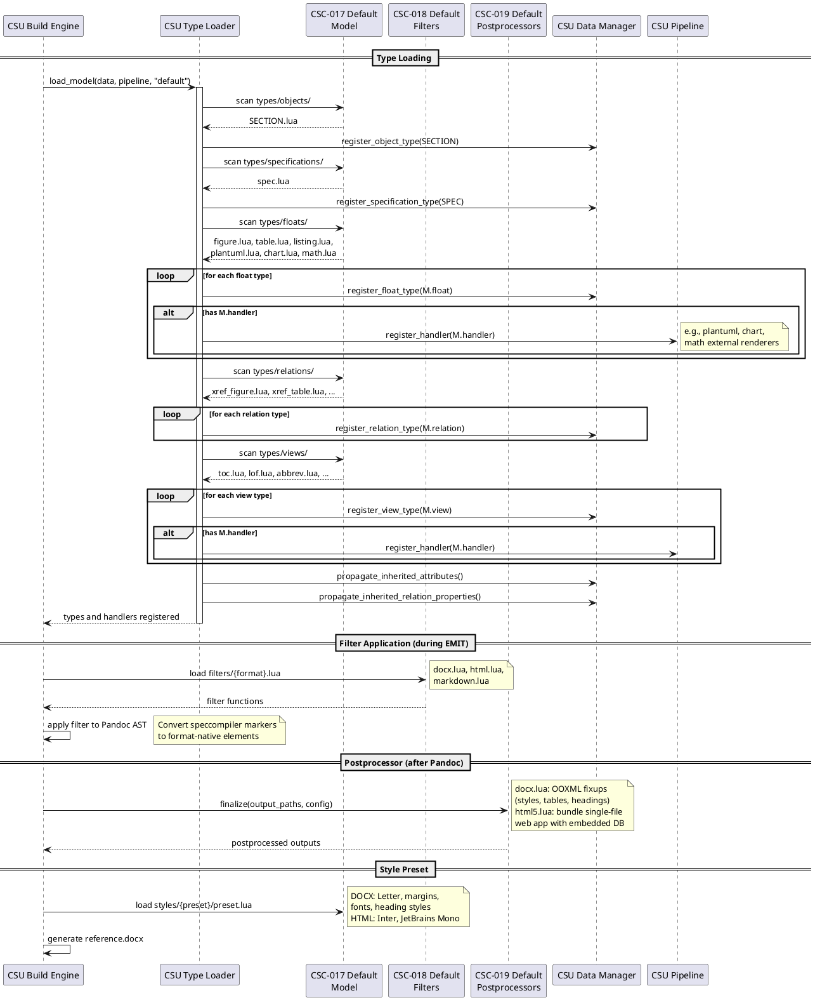

## Model Design

### FD: Type System and Domain Model Definition @FD-005

**Allocation:** Realized by [CSC-018](@) (Default Filters), [CSC-019](@) (Default Postprocessors), [CSC-021](@) (Default Styles), [CSC-022](@) (Default Float Types), [CSC-023](@) (Default Relation Types), and [CSC-024](@) (Default View Types).

The type system and domain model definition function encompasses the default model
components that provide base type definitions, format-specific processing, and style
configuration. These components are loaded by the [TERM-38](@) ([CSU-008](@)) during the
model discovery phase described in [FD-002](@) and collectively define the foundational
capabilities that all domain models inherit and extend.

**Model Directory Structure**: Each model provides a standard directory layout with
`types/` (objects, floats, relations, views, specifications), `filters/`, `postprocessors/`,
and `styles/` subdirectories. The default model (`models/default/`) establishes baseline
definitions for all five type categories.

**Type Definitions**: [CSC-022](@) defines float types (FIGURE, TABLE, LISTING, PLANTUML,
CHART, MATH) with counter groups for shared numbering. [CSC-023](@) defines cross-reference
relation types (XREF_FIGURE, XREF_TABLE, XREF_LISTING, XREF_MATH, XREF_CITATION) that
map `#` link selectors to target float types. [CSC-024](@) defines view types (TOC, LOF,
ABBREV, ABBREV_LIST, GAUSS, MATH_INLINE) with inline prefix syntax and materializer
strategies.

**Format Processing**: [CSC-018](@) provides Pandoc Lua filters for DOCX, HTML, and Markdown
output that convert speccompiler-format markers (page breaks, bookmarks, captions, equations)
into native output elements. [CSC-019](@) applies format-specific post-processing after Pandoc
output generation, loading template-specific fixup modules for DOCX and LaTeX. [CSC-021](@)
defines style presets with page layout, typography, and formatting configuration for DOCX
(Letter-sized, standard margins) and HTML (Inter/JetBrains Mono fonts, color palette) output.

**Component Interaction**

The default model is realized through six packages that define the baseline type system,
format processing, and style configuration inherited by all domain models.

[csc:default-float-types](#) (Default Float Types) defines the visual content types. [csu:figure-float-type](#) (FIGURE)
handles image-based floats. [csu:table-float-type](#) (TABLE) handles tabular data with CSV parsing.
[csu:listing-float-type](#) (LISTING) handles code blocks with syntax highlighting. [csu:plantuml-float-type](#) (PLANTUML)
renders UML diagrams via external subprocess. [csu:chart-float-type](#) (CHART) renders ECharts
visualizations. [csu:math-float-type](#) (MATH) renders LaTeX equations via KaTeX. Each type declares a
counter group for cross-specification numbering.

[csc:default-relation-types](#) (Default Relation Types) defines cross-reference relations that resolve `#`
link selectors to float targets. [csu:xreffigure-relation-type](#) (XREF_FIGURE) targets FIGURE floats. [csu:xreftable-relation-type](#)
(XREF_TABLE) targets TABLE floats. [csu:xreflisting-relation-type](#) (XREF_LISTING) targets LISTING floats.
[csu:xrefmath-relation-type](#) (XREF_MATH) targets MATH floats. [csu:xrefcitation-relation-type](#) (XREF_CITATION) resolves
bibliography citations via BibTeX keys.

[csc:default-view-types](#) (Default View Types) defines data views with inline prefix syntax. [csu:toc-view-type](#)
(TOC) generates tables of contents from spec objects. [csu:lof-view-type](#) (LOF) generates lists of
figures, tables, or listings by counter group. [csu:abbrev-view-type](#) (ABBREV) renders inline
abbreviation expansions. [csu:abbrevlist-view-type](#) (ABBREV_LIST) generates abbreviation glossaries.
[csu:gauss-view-type](#) (GAUSS) renders Gaussian distribution charts. [csu:mathinline-view-type](#) (MATH_INLINE)
renders inline LaTeX math expressions.

[csc:default-filters](#) (Default Filters) provides format-specific Pandoc Lua filters applied during
EMIT. [csu:docx-filter](#) (DOCX Filter) converts markers to OOXML-compatible elements — page breaks,
bookmarks, and custom styles. [csu:html-filter](#) (HTML Filter) converts markers to semantic HTML5
elements with CSS classes. [csu:markdown-filter](#) (Markdown Filter) normalizes markers for clean
Markdown output.

[csc:default-postprocessors](#) (Default Postprocessors) applies fixups after Pandoc generation. [csu:docx-postprocessor](#)
(DOCX Postprocessor) manipulates the OOXML package — injecting custom styles, fixing table
widths, and applying numbering overrides. [csu:latex-postprocessor](#) (LaTeX Postprocessor) applies
template-specific LaTeX fixups for PDF output.

[csc:default-styles](#) (Default Styles) provides output styling presets. [csu:docx-style-preset](#) (DOCX Style
Preset) defines page layout (Letter, standard margins), heading styles, table formatting, and
font selections for Word output. [csu:html-style-preset](#) (HTML Style Preset) defines the web typography
(Inter/JetBrains Mono), color palette, and responsive layout for HTML output.

---

### DD: Layered Model Extension with Override Semantics @DD-MODEL-001

Selected layered model loading where domain models extend and override the default model by type identifier.

> rationale: ID-based override enables clean domain specialization:
>
> - Default model loads first, establishing baseline types (SECTION, SPEC, float types, relations, views)
> - Domain model loads second; types with matching IDs replace defaults, new IDs add to the registry
> - Proof views follow the same pattern: domain proofs override defaults by `policy_key`
> - Attribute inheritance propagated iteratively after all types are loaded, enabling parent attributes to flow to child types across model boundaries
> - Filter, postprocessor, and style directories follow conventional naming for predictable discovery
> - Alternative of mixin composition rejected: ordering ambiguity when multiple mixins define the same attribute
