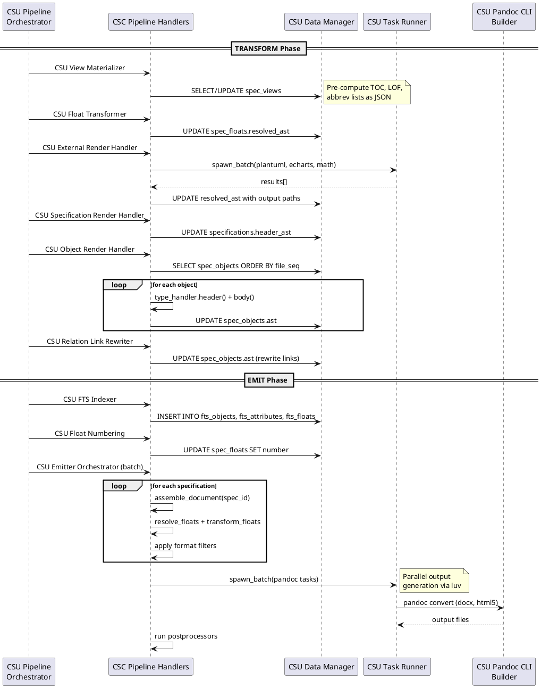

## Output Design

### FD: Multi-Format Publication @FD-004

> traceability: [SF-004](@)

**Allocation:** Realized by [CSC-012](@) (Transform Handlers) and [CSC-009](@) (Emit Handlers) through [CSU-060](@) (External Render Handler) and [CSU-037](@) (Emitter Orchestrator). Output infrastructure is provided by [CSC-004](@) (Infrastructure), with format-specific utilities in [CSC-013](@) (Format Utilities), DOCX generation in [CSC-014](@) (DOCX Generation), I/O operations in [CSC-015](@) (I/O Utilities), and external process management in [CSC-016](@) (Process Management).

The multi-format publication function encompasses the TRANSFORM and EMIT pipeline phases,
covering content rendering, view materialization, external subprocess rendering,
document assembly from the [TERM-IR](@) database, [TERM-04](@) numbering and resolution, and
parallel output generation via Pandoc.

**TRANSFORM Phase**: Prepares content for output through four handler stages:

- [CSU-064](@): Pre-computes view data (table of contents, list of figures/tables,
  abbreviation lists) and stores as JSON in `spec_views.resolved_data`. Dispatches by
  view type: `toc` queries spec_objects ordered by file_seq, `lof`/`lot` queries floats
  by counter_group, `abbrev_list` queries view content.

- [CSU-061](@): Resolves float content that does not require external rendering
  (e.g., CSV parsing, text processing) and updates `spec_floats.resolved_ast`.

- [CSU-060](@): Coordinates parallel subprocess rendering for float types
  requiring external tools (PlantUML, ECharts, Math). Prepares tasks via renderer callbacks,
  checks output cache for hits, and spawns remaining tasks in parallel via luv `spawn_batch()`.
  Results update `resolved_ast` with output paths.

- [CSU-062](@): Invokes type-specific handlers for each spec_object
  (ordered by file_seq). Type handlers provide `header()` and `body()` functions dispatched
  through the base handler wrapper. Rendered AST is merged back to `spec_objects.ast`.

- [CSU-063](@): Renders document title headers via specification type
  handlers, storing result in `specifications.header_ast`.

**EMIT Phase**: Assembles and generates output documents in multiple formats,
fulfilling multi-format output requirements:

- [CSU-039](@): Assigns sequential numbers to floats by counter_group (e.g., FIGURE,
  TABLE, LISTING, EQUATION) across all documents. Shared counter groups
  enable natural numbering where related visual content types form a single sequence.

- [CSU-034](@): Reconstructs a complete Pandoc AST from the Spec-IR database
  Queries spec_objects ordered by `file_seq`, decodes JSON AST fragments,
  normalizes header levels, and assembles floats and views into the document structure.
  Metadata is built from specification attributes and the assembler returns a complete
  `pandoc.Pandoc` document.

- [CSU-040](@): Builds a lookup map of rendered float results (ast, number, caption,
  type_ref) from `spec_floats` with `resolved_ast`. The resolver queries
  the database for all floats belonging to the current specification and indexes them for
  efficient lookup during document traversal.

- [CSU-035](@): Walks assembled document blocks and replaces float placeholder CodeBlocks
  with rendered Div elements containing captions and semantic CSS classes for
  format-specific styling.

- [CSU-041](@): Replaces view placeholder blocks with materialized content from the
  TRANSFORM phase. Views are expanded inline as formatted tables, lists, or custom
  structures depending on view type. Additionally, populates FTS5 virtual tables
  (`fts_objects`, `fts_attributes`, `fts_floats`) for [TERM-FTS](@) in the web
  application, converting AST to plain text and indexing searchable fields with Porter
  stemming.

- [CSU-042](@): Processes inline elements during emit - resolves `(@)` links to
  `#anchor` references, processes citations, and renders inline math expressions.

- [CSU-037](@): Format-agnostic orchestration for batch mode
  execution: (1) assigns float numbers globally, (2) assembles documents per
  specification, (3) resolves and transforms floats, (4) applies format-specific filters
  (docx, html), (5) serializes assembled documents to intermediate JSON via
  `pandoc.write(doc, "json")` to temporary files, (6) checks `output_cache` for staleness
  and skips generation when outputs are current, (7) spawns parallel Pandoc processes
  via luv for concurrent format conversion (docx, html5), and (8) cleans up intermediate
  JSON files after generation completes. Format-specific postprocessors run after Pandoc
  generation: DOCX postprocessing applies style fixups via OOXML manipulation, and HTML5
  postprocessing bundles assets for web application deployment.

**Infrastructure Support**: The Pandoc CLI wrapper ([CSU-079](@)) builds command arguments for multiple
output formats (docx, html5, markdown, json) with reference document, bibliography, and
filter support. The reference generator ([CSU-075](@)) creates `reference.docx` from style presets for
DOCX output styling.

**Component Interaction**

The output subsystem spans the TRANSFORM and EMIT pipeline phases, realized through
handler packages and infrastructure components.

[csc:transform-handlers](#) (Transform Handlers) prepares content for output. [csu:view-materializer](#) (View
Materializer) pre-computes view data as JSON. [csu:float-transformer](#) (Float Transformer) resolves float
content not requiring external tools. [csu:external-render-handler](#) (External Render Handler) coordinates
parallel subprocess rendering via luv. [csu:object-render-handler](#) (Object Render Handler) invokes type-specific
header/body renderers. [csu:specification-render-handler](#) (Specification Render Handler) renders document title
headers. [csu:relation-link-rewriter](#) (Relation Link Rewriter) rewrites `(@)` link targets to resolved anchors
in the final AST.

[csc:emit-handlers](#) (Emit Handlers) assembles and generates output documents. [csu:fts-indexer](#) (FTS
Indexer) populates full-text search tables. [csu:float-numbering](#) (Float Numbering) assigns sequential
numbers by counter group. [csu:document-assembler](#) (Document Assembler) reconstructs complete Pandoc AST
from Spec-IR. [csu:float-resolver](#) (Float Resolver) builds the rendered float lookup map. [csu:float-emitter](#)
(Float Emitter) replaces float placeholders with rendered Divs. [csu:view-emitter](#) (View Emitter)
expands view placeholders with materialized content. [csu:inline-handler-dispatcher](#) (Inline Handler Dispatcher)
processes inline elements — links, citations, math. [csu:float-handler-dispatcher](#) (Float Handler Dispatcher)
routes float rendering to type-specific handlers. [csu:view-handler-dispatcher](#) (View Handler Dispatcher) routes
view expansion to type-specific materializers. [csu:emitter-orchestrator](#) (Emitter Orchestrator) coordinates
the full emit sequence: numbering, assembly, resolution, filtering, and parallel Pandoc output.

[csc:infrastructure](#) (Infrastructure) provides cross-cutting utilities. [csu:hash-utilities](#) (Hash Utilities)
computes SHA1 hashes for cache coherency. [csu:logger](#) (Logger) implements NDJSON structured
logging. [csu:json-utilities](#) (JSON Utilities) handles JSON serialization for AST interchange.
[csu:reference-cache](#) (Reference Cache) caches resolved cross-references for O(1) lookup during emit.
[csu:mathml-to-omml-converter](#) (MathML to OMML Converter) translates MathML equations to Office Math Markup for
DOCX output.

[csc:format-utilities](#) (Format Utilities) provides format-specific helpers. [csu:format-writer](#) (Format Writer)
serializes AST to intermediate JSON for Pandoc consumption. [csu:xml-utilities](#) (XML Utilities)
generates and manipulates XML for OOXML postprocessing. [csu:zip-utilities](#) (ZIP Utilities) handles
DOCX archive creation and modification.

[csc:docx-generation](#) (DOCX Generation) produces Word documents. [csu:preset-loader](#) (Preset Loader) reads
style preset definitions from Lua files. [csu:style-builder](#) (Style Builder) generates OOXML style
elements from preset values. [csu:ooxml-builder](#) (OOXML Builder) assembles the final DOCX package
with styles, numbering, and content parts. [csu:reference-generator](#) (Reference Generator) creates
`reference.docx` for Pandoc's `--reference-doc` option.

[csc:io-utilities](#) (I/O Utilities) provides file-system operations. [csu:document-walker](#) (Document Walker)
traverses specification documents and their includes to build processing contexts. [csu:file-walker](#)
(File Walker) scans directories for files matching glob patterns during model discovery.

[csc:process-management](#) (Process Management) manages external subprocesses. [csu:pandoc-cli-builder](#) (Pandoc CLI
Builder) constructs Pandoc command-line arguments for each output format. [csu:task-runner](#) (Task
Runner) provides the luv-based parallel task executor used by both external float rendering
and batch Pandoc output generation.

---

### DD: NDJSON Logging @DD-INFRA-001

Selected Newline-Delimited JSON format for structured logging.

> rationale: NDJSON enables:
>
> - Machine-parseable log output for CI/CD integration
> - Structured data (level, message, timestamp, context)
> - Easy filtering and analysis with standard tools (jq)
> - Human-readable when formatted
>
> Configuration via `config.logging.level` with env override `SPECCOMPILER_LOG_LEVEL`.

---

### DD: Parallel Task Execution @DD-INFRA-002

Selected luv (libuv) for parallel subprocess execution.

> rationale: Document processing benefits from parallel execution:
>
> - External renderers (PlantUML, ECharts) run concurrently
> - Pandoc output generation runs in parallel for multiple formats
> - luv provides cross-platform async I/O without external dependencies

---

### DD: Preset-Based DOCX Styles @DD-INFRA-003

Selected preset system for DOCX style customization.

> rationale: Corporate documents require consistent styling. The preset system:
>
> - Loads style definitions from Lua files
> - Generates reference.docx with custom styles
> - Caches generated reference based on preset hash
> - Enables style changes without modifying source documents

---

### DD: Deno Runtime for External Tools @DD-TOOLS-001

Selected Deno as the runtime for TypeScript-based external tools.

> rationale: Deno provides:
>
> - Single-file TypeScript execution without build step
> - Built-in npm module support via `npm:` specifiers
> - Permission-based security model
> - Cross-platform compatibility
>
> Tools are spawned via `task_runner.spawn_sync()` with timeout handling.

---

### DD: Pandoc as Document Processing Engine @DD-CORE-005

Selected Pandoc as the document parsing and output generation engine.

> rationale: Pandoc serves as both input parser and output generator:
>
> - CommonMark+extensions parsing via `pandoc.read()` provides a well-defined AST
> - Lua filter API enables in-process AST manipulation without subprocess overhead for parsing
> - Multi-format output (DOCX, HTML5, Markdown, LaTeX/PDF, JSON) from a single intermediate representation
> - `--reference-doc` support enables DOCX style customization via generated reference.docx
> - `--lua-filter` support enables format-specific transformations (docx.lua, html.lua)
> - Native bibliography support (--bibliography, --csl) for citation processing
> - Broad ecosystem adoption provides stability and community support
