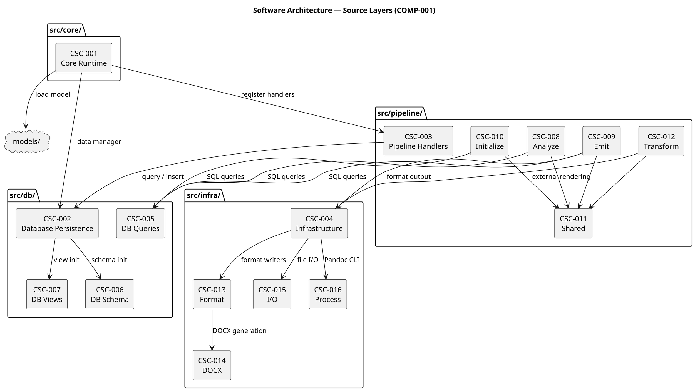
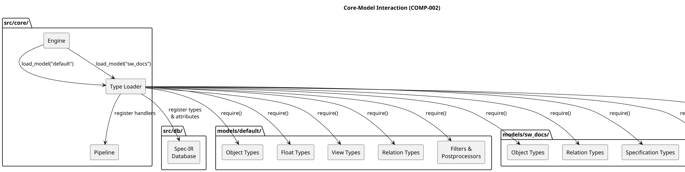

## Pipeline Architecture

### Overview

SpecCompiler uses a layered architecture with the engine orchestrating a five-phase [TERM-15](@) that processes documents through registered [TERM-16](@).

### Component Summary

The architecture comprises **30 CSCs** organized in four source layers and two model packages.
For the complete decomposition with all 162 CSUs, see the [Software Decomposition](software_decomposition.md) chapter.

`csc_decomposition:`

### Core–Model Interaction

The core runtime discovers and loads model packages at startup via the [TERM-38](@).
Each model contributes five categories of type modules that are registered into the Spec-IR and Pipeline.

### Execution Flow

1. **engine.run_project()** loads config and creates database
2. **[TERM-38](@).load_model()** registers types from models/
3. **Pipeline.execute()** runs 5 phases with registered handlers (`INITIALIZE -> ANALYZE -> TRANSFORM -> VERIFY -> EMIT`)
4. Each handler receives (data, context, diagnostics)
5. EMIT phase uses batch mode for parallel output
