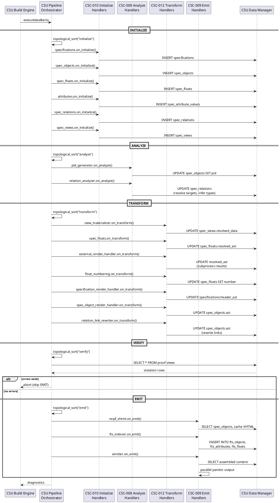

## Pipeline Design

### FD: Pipeline Execution Orchestration @FD-001

> traceability: [SF-001](@)

**Allocation:** Realized by [CSC-001](@) (Core Runtime) through [CSU-005](@) (Build Engine) and [CSU-006](@) (Pipeline Orchestrator), with handlers registered via [CSC-003](@) (Pipeline Handlers). Phase-specific handlers are organized in [CSC-008](@) (Analyze Handlers), [CSC-010](@) (Initialize Handlers), and [CSC-012](@) (Transform Handlers), with shared utilities in [CSC-011](@) (Shared Pipeline Utilities).

The [TERM-15](@) execution orchestration function manages the five-phase document processing
lifecycle from initial Pandoc hook entry through final output generation. It encompasses
[TERM-16](@) registration, dependency-based execution ordering, context propagation, and
phase abort logic.

**Entry Point**: The Pandoc filter ([CSU-005](@)) hooks into the Pandoc Meta callback, extracts
project metadata via [CSU-009](@), and invokes the build engine. The engine creates the
database, initializes the data manager, loads the model via [CSU-008](@), processes
document files (with [TERM-30](@) checks), and delegates to the pipeline orchestrator.

**Handler Registration**: During model loading, [CSU-008](@) registers each handler with the Pipeline Orchestrator [CSU-006](@), which enforces the registration contract by validating that every handler declares both a `name` and a `[TERM-24](@)` field before accepting registration. The orchestrator rejects duplicate handler names — attempting to register a handler whose name already exists raises an immediate error. Accepted handlers are stored in a lookup table keyed by name for O(1) retrieval during phase execution. Each handler implements phase hooks using the naming convention `on_{phase}` (e.g., `on_initialize`, `on_analyze`, `on_transform`, `on_verify`, `on_emit`). All hooks receive the full contexts array: `on_{phase}(data, contexts, diagnostics)`.

**[TERM-25](@)**: Before executing each phase, the Pipeline Orchestrator [CSU-006](@) applies Kahn's algorithm to produce a deterministic handler execution order. Only handlers that implement an `on_{phase}` hook for the current phase participate in the sort; handlers without a relevant hook are skipped entirely. The algorithm begins by building a dependency graph restricted to participants and initializing an in-degree count for each node. Nodes with zero in-degree — handlers whose prerequisites are already satisfied — seed a processing queue. At each step the algorithm dequeues the first node, appends it to the sorted output, and decrements the in-degree of all its dependents; any dependent whose in-degree reaches zero is enqueued. Alphabetical tie-breaking is applied at every dequeue step so that handlers at the same dependency depth are always emitted in the same order, guaranteeing deterministic output across runs. After the queue is exhausted, if the sorted list length is less than the participant count a dependency cycle exists and is reported as an error.

> For example, if INITIALIZE has three handlers — `specifications` (no prerequisites), `spec_objects` (prerequisite: `specifications`), and `spec_floats` (prerequisite: `specifications`) — the sort produces `[specifications, spec_floats, spec_objects]`, with `spec_floats` and `spec_objects` ordered alphabetically since both depend only on `specifications`.

**Phase Execution**: The pipeline executes five phases in order:

1. **[TERM-19](@)** — Parse Pandoc [TERM-AST](@) into [TERM-IR](@) database tables (specifications,
   spec_objects, attributes, spec_floats, spec_views, spec_relations)
2. **[TERM-20](@)** — Resolve cross-references and infer relation types
3. **[TERM-22](@)** — Render content, materialize views, execute external renderers
4. **[TERM-21](@)** — Run proof views and collect diagnostics
5. **[TERM-23](@)** — Assemble documents and generate output files

All phases use the same dispatch model: for each handler in sorted order, the Pipeline Orchestrator [CSU-006](@) calls the handler's `on_{phase}(data, contexts, diagnostics)` hook once with the full set of contexts. Handlers are responsible for iterating over contexts internally. Each handler invocation is bracketed by `uv.hrtime()` calls at nanosecond precision to record its duration, and the orchestrator also records the aggregate duration of each phase, providing two-level performance visibility (handler-level and phase-level).

**Phase Abort**: After VERIFY, the Pipeline Orchestrator [CSU-006](@) inspects the diagnostics collector for any error-level entries. If errors exist, the pipeline aborts before EMIT — only output generation is skipped, since TRANSFORM has already completed. This design allows proof views to validate transform results before committing to output.

**Context Propagation**: Each document file produces a context containing the parsed AST,
file path, specification ID, and walker state. Contexts are passed through all phases,
accumulating state. The diagnostics collector aggregates errors and warnings across all
handlers and contexts.

**Component Interaction**

The pipeline is realized through the core runtime and four handler packages that
correspond to pipeline phases.

[csc:core-runtime](#) (Core Runtime) provides the entry point and orchestration layer. [csu:pandoc-filter-entry-point](#)
(Pandoc Filter Entry Point) hooks into the Pandoc callback to launch the build. [csu:configuration-parser](#)
(Configuration Parser) reads `project.yaml` and resolves model, output, and logging settings.
[csu:data-loader](#) (Data Loader) loads external data files referenced by specifications. [csu:build-engine](#)
(Build Engine) coordinates the full build lifecycle — creating the database, loading the
model, processing document files with cache checks, and delegating to [csu:pipeline-orchestrator](#) (Pipeline
Orchestrator) for phase execution. The orchestrator drives topological sort, handler dispatch,
timing, and abort logic across all five phases.

[csc:pipeline-handlers](#) (Pipeline Handlers) registers cross-cutting handlers. [csu:include-expansion-filter](#) (Include
Expansion Filter) resolves `include` directives during INITIALIZE, expanding referenced
files into the document AST before entity parsing begins.

[csc:initialize-handlers](#) (Initialize Handlers) parses the Pandoc AST into Spec-IR entities. [csu:specification-parser](#)
(Specification Parser) extracts document-level metadata, [csu:object-parser](#) (Object Parser) identifies
typed content blocks, [csu:attribute-parser](#) (Attribute Parser) extracts key-value attributes from object
paragraphs, [csu:float-parser](#) (Float Parser) detects embedded figures, tables, and listings,
[csu:relation-parser](#) (Relation Parser) captures cross-reference links, and [csu:view-parser](#) (View Parser)
identifies view directives.

[csc:analyze-handlers](#) (Analyze Handlers) resolves cross-references and infers types. [csu:relation-resolver](#)
(Relation Resolver) matches link targets to spec objects using selector-based resolution.
[csu:relation-type-inferrer](#) (Relation Type Inferrer) assigns relation type_refs based on source and target
object types. [csu:attribute-caster](#) (Attribute Caster) validates and casts attribute values against their
declared datatypes.

[csc:shared-pipeline-utilities](#) (Shared Pipeline Utilities) provides reusable base modules consumed by handlers
across phases. [csu:spec-object-base](#) (Spec Object Base) and [csu:specification-base](#) (Specification Base) provide
shared parsing logic for objects and specifications. [csu:float-base](#) (Float Base) provides
float detection and extraction. [csu:attribute-paragraph-utilities](#) (Attribute Paragraph Utilities) parses attribute
blocks from definition-list paragraphs. [csu:include-handler](#) (Include Handler) and [csu:include-utilities](#)
(Include Utilities) manage file inclusion and path resolution. [csu:render-utilities](#) (Render Utilities)
and [csu:math-render-utilities](#) (Math Render Utilities) provide AST-to-output conversion helpers. [csu:view-utilities](#)
(View Utilities) supports view parsing and materialization. [csu:source-position-compatibility](#) (Source Position
Compatibility) normalizes Pandoc source position data across API versions.

---

### DD: SQLite as Spec-IR Persistence Engine @DD-CORE-001

Selected SQLite as the persistence engine for the Specification Intermediate Representation.

> rationale: SQLite provides:
>
> - Zero-configuration embedded database requiring no server process
> - Single-file database portable across platforms (specir.db)
> - SQL-based query interface enabling declarative proof views and resolution logic
> - ACID transactions for reliable incremental builds with cache coherency
> - Built-in FTS5 for full-text search in the web application output
> - Mature Lua binding (lsqlite3) available in the Pandoc ecosystem

---

### DD: EAV Attribute Storage Model @DD-CORE-002

Selected Entity-Attribute-Value storage for dynamic object and float attributes.

> rationale: The EAV model enables runtime schema extension through model definitions:
>
> - Object types declare custom attributes in Lua modules without DDL changes
> - New models can add attributes by declaring them in type definitions
> - Typed columns provide SQL-level type safety while preserving EAV flexibility
> - Per-type pivot views (view_{type}_objects) generated dynamically from spec_attribute_types restore columnar access for queries
> - Alternative of wide tables rejected: column set unknown at schema creation time since models load after initialization

---

### DD: Five-Phase Pipeline Architecture @DD-CORE-003

Selected a five-phase sequential pipeline (INITIALIZE, ANALYZE, TRANSFORM, VERIFY, EMIT) for document processing.

> rationale: Five phases separate concerns and enable verification before output:
>
> - INITIALIZE parses AST into normalized relational IR before any resolution
> - ANALYZE resolves cross-references and infers types on the complete IR, not partial state
> - TRANSFORM renders content and materializes views with all references resolved
> - VERIFY runs proof views after TRANSFORM so it can check transform results (e.g., float render failures, view materialization)
> - EMIT generates output only after verification passes, preventing invalid documents
> - VERIFY-before-EMIT enables abort on error without wasting output generation time
> - Phase ordering is fixed; handler ordering within each phase is controlled by topological sort

---

### DD: Topological Sort for Handler Ordering @DD-CORE-004

Selected Kahn's algorithm with declarative prerequisite arrays for handler execution ordering within each pipeline phase.

> rationale: Declarative prerequisites with topological sort enable:
>
> - Handlers declare `prerequisites = {"handler_a", "handler_b"}` rather than manual sequence numbers
> - Only handlers implementing the current phase's hook participate in the sort
> - Alphabetical tie-breaking at equal dependency depth guarantees deterministic execution across runs
> - Cycle detection with error reporting prevents invalid configurations
> - New handlers (including model-provided handlers) integrate by declaring their prerequisites without modifying existing handlers
> - Alternative of priority numbers rejected: fragile when inserting new handlers between existing priorities
