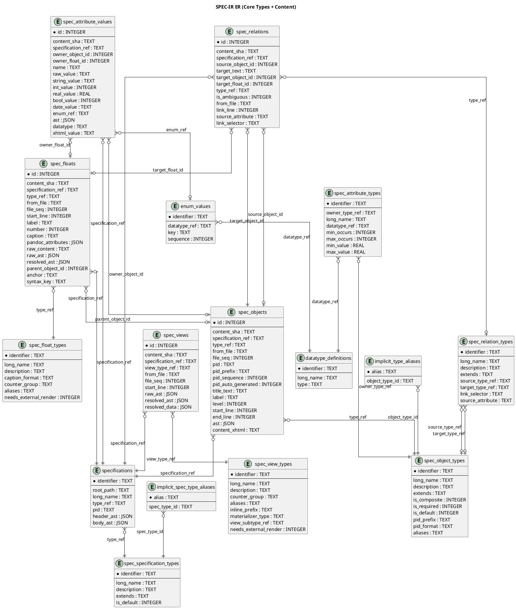
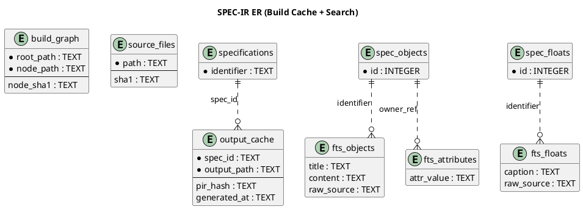

## SPEC-IR Database Schema

### Overview

The Specification [TERM-IR](@) (SPEC-IR) is implemented as a [TERM-SQLITE](@) schema composed from:

- `src/db/schema/types.lua`
- `src/db/schema/content.lua`
- `src/db/schema/build.lua`
- `src/db/schema/search.lua`
- `src/db/schema/init.lua` (combines all schema modules, initializes EAV pivot views)

The schema has four domains:

| Domain | Tables |
|---|---|
| Type system | `spec_specification_types`, `spec_object_types`, `spec_float_types`, `spec_relation_types`, `spec_view_types`, `datatype_definitions`, `spec_attribute_types`, `enum_values`, `implicit_type_aliases`, `implicit_spec_type_aliases` |
| Content | `specifications`, `spec_objects`, `spec_floats`, `spec_relations`, `spec_views`, `spec_attribute_values` |
| Build cache | `build_graph`, `source_files`, `output_cache` |
| Search (FTS5) | `fts_objects`, `fts_attributes`, `fts_floats` |

> Note: FTS5 creates shadow tables (`*_data`, `*_idx`, `*_docsize`, etc.) automatically; they are managed by SQLite internals.

### ER-001: Type + Content

### ER-002: Build + Search

### Notes

- ReqIF cache columns (`spec_objects.content_xhtml`, `spec_attribute_values.xhtml_value`) are part of the main `src/db/schema/content.lua` schema.
- `build_graph`, `source_files`, and `output_cache` support incremental builds and output invalidation.
- FTS tables are populated for cross-document search and may be absent/empty until indexing runs.
