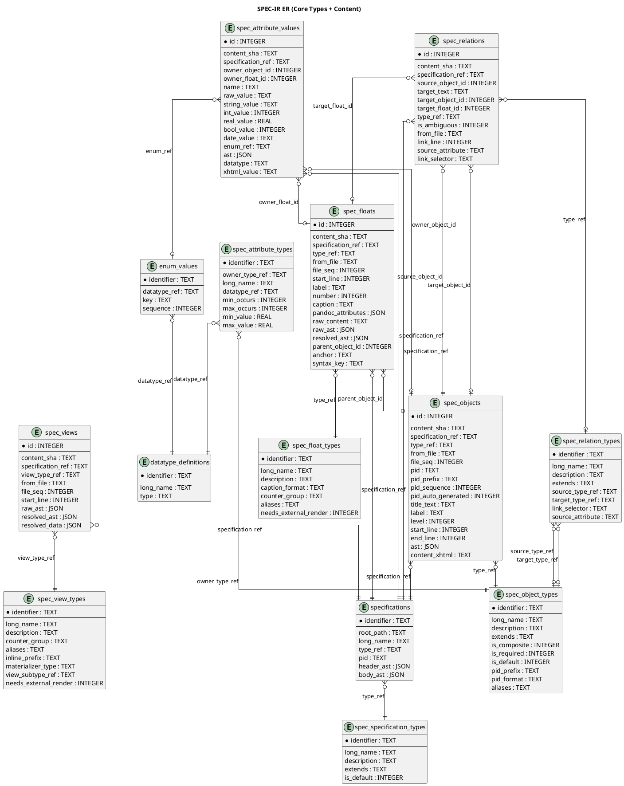

## SPEC-IR Database Schema

### Overview

The Specification [TERM-IR](@) (SPEC-IR) is implemented as a [TERM-SQLITE](@) schema composed from:

- `src/db/schema/types.lua`
- `src/db/schema/content.lua`
- `src/db/schema/build.lua`
- `src/db/schema/search.lua`
- `src/db/schema/init.lua` (combines all schema modules, initializes EAV pivot views)

The schema has four domains:

```list-table:tbl-specIR-domains{caption="Schema domains"}
> header-rows: 1
> aligns: l,l

* - Domain
  - Tables
* - Type system
  - `spec_specification_types`, `spec_object_types`, `spec_float_types`, `spec_relation_types`, `spec_view_types`, `datatype_definitions`, `spec_attribute_types`, `enum_values`
* - Content
  - `specifications`, `spec_objects`, `spec_floats`, `spec_relations`, `spec_views`, `spec_attribute_values`
* - Build cache
  - `build_graph`, `source_files`, `output_cache`
* - Search (FTS5)
  - `fts_objects`, `fts_attributes`, `fts_floats`
```

### Type + Content (specIR)

specIR is a ReqIF inspired relational metamodel that lowers textual specifications into a typed intermediate representation against which structural validity is evaluated.

Where Pandoc provides the syntactic bridge from Markdown to a structured AST, specIR provides the semantic layer by separating: a type layer (Γ), which defines what may exist and a content layer, which records what does exist.

Validation reduces to relational set operations: constraints are expressed as queries over finite sets of entities and relations, and violations emerge as counterexamples (e.g., anti-joins between expected and actual structures).


