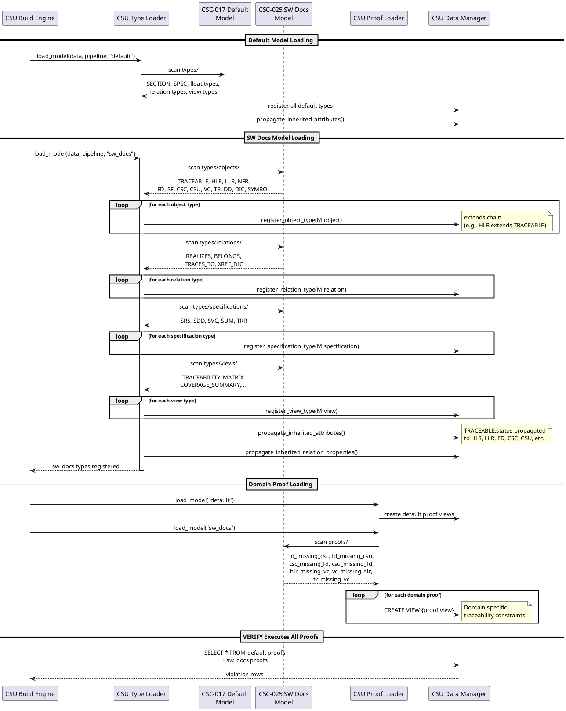

## SW Docs Model Design

### FD: Software Documentation Domain Model @FD-007

**Allocation:** Realized by [CSC-025](@) (SW Docs Model), with domain proof views in [CSC-026](@) (SW Docs Proof Views), object types in [CSC-027](@) (SW Docs Object Types), relation types in [CSC-028](@) (SW Docs Relation Types), specification types in [CSC-029](@) (SW Docs Specification Types), and view types in [CSC-030](@) (SW Docs View Types).

The software documentation domain model extends the default model with traceable object
types, domain-specific relation semantics, specification document types, and verification
views for MIL-STD-498 and DO-178C compliant software documentation workflows.

**Object Type Taxonomy**: [CSC-027](@) defines the TRACEABLE abstract base type providing
an inherited status enum (Draft, Review, Approved, Implemented) that all domain objects
extend. The taxonomy includes requirements (HLR, LLR, NFR), design elements (FD, SF, DD),
architectural decomposition (CSC, CSU), verification artifacts (VC, TR), and reference
types (DIC, SYMBOL). Each type declares its own attributes, PID prefix, and inheritance
chain through the `extends` field.

**Relation Types**: [CSC-028](@) defines domain-specific traceability relations: REALIZES
(FD traces to SF via the `traceability` source attribute), BELONGS (HLR membership in SF
via `belongs_to`), TRACES_TO (general-purpose `@` link traceability), XREF_DIC (dictionary
cross-references), and XREF_DECOMPOSITION (references targeting CSC/CSU elements). These
relations enable automated traceability matrix generation and coverage analysis.

**Specification Types**: [CSC-029](@) defines document types for the software documentation
lifecycle: SRS (Software Requirements Specification), SDD (Software Design Description),
SVC (Software Verification Cases), SUM (Software User Manual), and TRR (Test Results
Report). Each type declares version, status, and date attributes.

**View Types**: [CSC-030](@) defines domain-specific views for generating traceability
matrices (TRACEABILITY_MATRIX, TEST_EXECUTION_MATRIX, TEST_RESULTS_MATRIX) and coverage
summaries (COVERAGE_SUMMARY, REQUIREMENTS_SUMMARY).

**Proof Views**: [CSC-026](@) provides domain-specific proof view queries that enforce
traceability constraints: VC must trace to HLR, TR must trace to VC, every HLR must be
covered by at least one VC, every FD must trace to at least one CSC and CSU, and every
CSC and CSU must have at least one FD allocated. [CSC-025](@) provides the HTML5
postprocessor that generates a single-file documentation web app with embedded CSS, JS,
and SQLite-WASM full-text search.

**Component Interaction**

The software documentation domain model is realized through six packages that extend the
default model with traceable types, domain relations, document types, verification views,
and proof constraints.

[csc:sw-docs-object-types](#) (SW Docs Object Types) defines the domain object taxonomy. [csu:traceable-base-object-type](#)
(TRACEABLE Base Object Type) provides the abstract base with an inherited status enum
(Draft, Review, Approved, Implemented) that all domain objects extend. Requirements:
[csu:hlr-object-type](#) (HLR) for high-level requirements, [csu:llr-object-type](#) (LLR) for low-level
requirements, and [csu:nfr-object-type](#) (NFR) for non-functional requirements. Design elements:
[csu:fd-object-type](#) (FD) for functional descriptions and [csu:sf-object-type](#) (SF) for software functions.
Architecture: [csu:csc-object-type](#) (CSC) for computer software components and [csu:csu-object-type](#) (CSU) for
computer software units. Verification: [csu:vc-object-type](#) (VC) for verification cases and
[csu:tr-object-type](#) (TR) for test results. Design decisions: [csu:dd-object-type](#) (DD) for design decision
records. Reference types: [csu:dic-object-type](#) (DIC) for dictionary entries and [csu:symbol-object-type](#) (SYMBOL)
for symbol definitions.

[csc:sw-docs-relation-types](#) (SW Docs Relation Types) defines domain-specific traceability relations.
[csu:realizes-relation-type](#) (REALIZES) traces FD to SF via the `traceability` source attribute. [csu:belongs-relation-type](#)
(BELONGS) establishes HLR membership in SF via `belongs_to`. [csu:tracesto-relation-type](#) (TRACES_TO) provides
general-purpose `@` link traceability between any traceable objects. [csu:xrefdic-relation-type](#) (XREF_DIC)
resolves dictionary cross-references targeting DIC entries.

[csc:sw-docs-specification-types](#) (SW Docs Specification Types) defines document types for the software
documentation lifecycle. [csu:srs-specification-type](#) (SRS) for Software Requirements Specifications.
[csu:sdd-specification-type](#) (SDD) for Software Design Descriptions. [csu:svc-specification-type](#) (SVC) for Software
Verification Cases. [csu:sum-specification-type](#) (SUM) for Software User Manuals. [csu:trr-specification-type](#) (TRR) for Test
Results Reports. Each type declares version, status, and date attributes.

[csc:sw-docs-view-types](#) (SW Docs View Types) defines domain-specific views for documentation output.
[csu:traceability-matrix-view](#) (Traceability Matrix) generates requirement-to-design traceability matrices.
[csu:test-execution-matrix-view](#) (Test Execution Matrix) generates verification case execution status tables.
[csu:test-results-matrix-view](#) (Test Results Matrix) generates test result summary tables. [csu:coverage-summary-view](#) (Coverage
Summary) computes requirement coverage statistics. [csu:requirements-summary-view](#) (Requirements Summary)
generates requirement status dashboards.

[csc:sw-docs-proof-views](#) (SW Docs Proof Views) provides domain-specific traceability verification rules.
[csu:vc-missing-hlr-traceability](#) (VC Missing HLR Traceability) ensures every verification case traces to at least
one HLR. [csu:tr-missing-vc-traceability](#) (TR Missing VC Traceability) ensures every test result traces to a
verification case. [csu:hlr-missing-vc-coverage](#) (HLR Missing VC Coverage) ensures every HLR is covered by at
least one VC. [csu:fd-missing-csc-traceability](#) (FD Missing CSC Traceability) ensures every FD references at least
one CSC. [csu:fd-missing-csu-traceability](#) (FD Missing CSU Traceability) ensures every FD references at least one
CSU. [csu:csc-missing-fd-allocation](#) (CSC Missing FD Allocation) ensures every CSC is allocated to at least one
FD. [csu:csu-missing-fd-allocation](#) (CSU Missing FD Allocation) ensures every CSU is allocated to at least one FD.

[csc:sw-docs-model](#) (SW Docs Model) provides the domain postprocessor. [csu:html5-postprocessor](#) (HTML5
Postprocessor) generates a single-file documentation web application with embedded CSS, JS,
navigation, and SQLite-WASM full-text search from the Spec-IR database.

