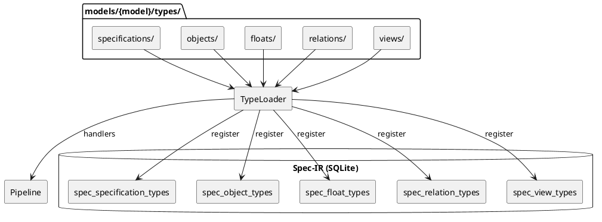

## Type System Architecture

### Overview

SpecCompiler uses a dynamic type system where models define available types for objects, [TERM-04](@), relations, and views.



### Type Module Structure

Each type module exports a category-specific definition:

```lua
-- Example: models/default/types/objects/hlr.lua
local M = {}

M.object = {
    id = "HLR",
    long_name = "High-Level Requirement",
    description = "System-level requirement",
    extends = "TEXTUAL",
    attributes = {
        { name = "status", datatype = "STATUS_ENUM", min_occurs = 1 },
        { name = "rationale", datatype = "STRING" }
    }
}

-- Optional handler for custom rendering
M.handler = {
    name = "hlr_render",
    prerequisites = { "spec_objects" },
    on_transform = function(data, ctx, diag) ... end
}

return M
```

### Type Categories

| Category | Database Table | Key Fields |
|----------|---------------|------------|
| Specifications | spec_specification_types | id, long_name, extends, is_default |
| Objects | spec_object_types | id, long_name, extends, is_default (HLR, FD, CSC, CSU, VC, etc.) |
| Floats | spec_float_types | id, long_name, counter_group, needs_external_render |
| Relations | spec_relation_types | id, source_type_ref, target_type_ref, link_selector |
| Views | spec_view_types | id, materializer_type, counter_group |

### Loading Process

1. [TERM-38](@) scans models/{model}/types/{category}/
2. Each .lua file is loaded and checked for exports
3. Type definitions registered in corresponding DB tables
4. Handlers registered with pipeline if present
