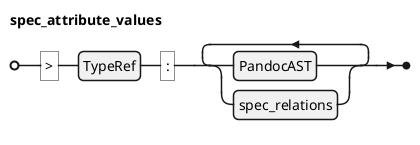

### Attribute @specIR-04

An **Attribute** stores metadata for specifications and spec objects using an Entity-Attribute-Value (EAV) pattern. Attributes are defined in blockquotes following headers and support multiple datatypes including strings, integers, dates, enums, and rich XHTML content (Pandoc AST). Relations are extracted from the AST. Attribute definitions constrain which attributes each object type can have.

#### Declaration

A **Spec Attribute** is a triple `$: A = (tau, beta, cc R)` where:
- `$: tau in Gamma . TT_A` is the attribute type (e.g., "status", "priority", "rationale").
- `$: beta` is the nested blockquote content (Pandoc AST).
- `$: cc R sube "SpecRelations"` is the set of child relations. 

#### Syntax

