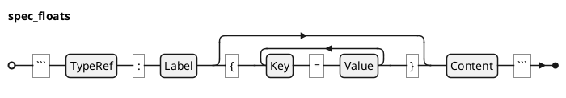

### Spec Float  @specIR-03

A **Spec Float** represents a floating element like a figure, table, or diagram. Floats are created from fenced code blocks with a `syntax:label` pattern. They are automatically numbered within their counter group and can be cross-referenced by their label. Some floats require external rendering (e.g., PlantUML diagrams).

#### Definition

A **Spec Float** is formally defined as a tuple `$: F = (tau, "label", cc "kv", "content")` where:
- `$: tau in Gamma . TT_F` is the float type (e.g., FIGURE, TABLE, PLANTUML, MATH).
- `$: label in "String"` is the label used for cross-referencing (normalized to `{type_prefix}:{user_label}`).
- `$: cc kv sube "FloatAttribute"` is the set of untyped metadata.
- `$: "content"` is raw text of the float to be transformed.

#### Grammar

