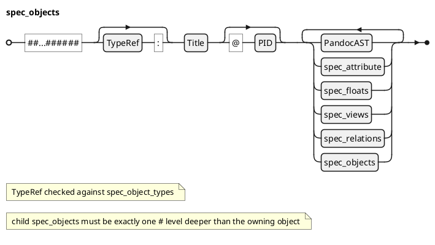

### Spec Object @specIR-02

A **Spec Object** represents a traceable element in a specification document, created from H2-H6 headers. Objects can be requirements (HLR, LLR), non-functional requirements (NFR), or structural sections (SECTION). Each object has a type, PID and can contain attributes and body content.

#### Declaration

A **Spec Object** is formally defined as a tuple `$: O = (tau, "title", "pid", beta, cc A, cc F, cc R, cc V, cc O)` where:
- `$: tau in Gamma . TT_O` is the object type (e.g., HLR, NFR, SECTION).
- `$: title in "String"` is the plain-text title from the header.
- `$: "pi"d in "String"` is the project identifier for cross-referencing (auto-generated when not explicit).
- `$: beta` is the accumulated body content (Pandoc AST).
- `$: cc A sube "SpecAttribute"` is the set of typed attributes attached to this object.
- `$: cc F sube "SpecFloat"` is the set of child floats contained in this object.
- `$: cc R sube "SpecRelations"` is the set of child relations contained in `$: beta"`.
- `$: cc V sube "SpecViews"` is the set of child views contained in this object.
- `$: cc O sube "SpecObject"` is the set of child objects contained in this object.

#### Syntax

