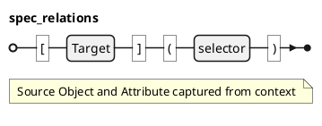

### Spec Relation @specIR-05

A **Spec Relation** represents a traceability link between specification elements. Relations are created from Markdown links where the link target (URL) acts as a **selector** that drives type inference. The relation type is not authored explicitly, it is inferred from the selector, the source context, and the resolved target. Resolution is type-driven: the `extends` chain of the inferred type determines how targets are resolved.

#### Declaration

A **Spec Relation** is a 4-tuple `$: R = (s, t, sigma, alpha)` where:
- `$: s in cc O` is the source object.
- `$: t in (cc O uu cc F)` is the target element (object or float).
- `$: sigma in "String"` is the link selector.
- `$: alpha in "String" uu {bot}` is the source attribute containing the link, or `$: bot` when the link appears in body text.

The relation type `$: rho in Gamma . TT_R` is **inferred** `$: rho = "infer"(sigma, alpha, tau_s, tau_t)`

#### Syntax

