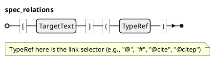

### Spec Relation @DIC-REL-001

A **Spec Relation** represents a traceability link between specification elements. Relations are created from Markdown links like `[PID](@)` (PID/object reference) and `[type:label](#)` (label/float-or-object reference), plus extended selectors like `@cite`.

Relations are extracted from Markdown links of the form `[target_text](selector)` where `selector` begins with `@` or `#`.

- `target_text` (the link text) carries the reference payload (PID, float label, citation key, etc.).
- `selector` (the link target/URL) is treated as a dispatch key (e.g., `@`, `#`, `@cite`).

Let `$: cc O` be the set of spec objects and `$: cc F` the set of floats in the current Spec-IR.

A **Spec Relation** is a 4-tuple `$: R = (s, t, sigma, alpha)` where:
- `$: s in cc O` is the source object.
- `$: t in (cc O uu cc F) uu {bot}` is the target element (object or float), or `$: bot` when unresolved / external.
- `$: sigma in "String"` is the link selector (must begin with `@` or `#`).
- `$: alpha in "String" uu {bot}` is the source attribute containing the link, or `$: bot` when the link appears in body text.

In the database (`spec_relations`), the same relation moves through three states:

1. **Extracted (INITIALIZE)**: `(s, target_text, sigma, alpha)` is stored; `type_ref` and resolved targets are NULL.
2. **Resolved (ANALYZE)**: for selectors that have a registered resolver (built-ins: `@` and `#`), `t` is resolved into `target_object_id` or `target_float_id` (or remains `$: bot`).
3. **Typed (ANALYZE)**: `type_ref` (`$: rho`) is inferred from rule matching and stored on the relation row.

Unlike other entities, relations are not explicitly typed at authoring time. Instead, the relation type `$: rho in Gamma . TT_R` is **inferred**:

`$: rho = "infer"(sigma, alpha, tau_s, tau_t)`

where `$: tau_s = type(s)` and `$: tau_t = type(t)` (or `$: bot` when `$: t = bot`). 

#### Grammar

### Inference Algorithm

Relation `type_ref` is inferred during ANALYZE by matching each relation against relation type rules (`spec_relation_types`) using four dimensions:
- `link_selector`
- `source_attribute`
- `source_type_ref`
- `target_type_ref`

Each rule may constrain any subset of the four dimensions. A rule matches iff every constrained dimension matches the relation context `$: (sigma, alpha, tau_s, tau_t)`. The winner is the unique matching rule with maximum specificity (the number of constrained dimensions). If two rules tie at maximum specificity, inference is ambiguous. If no rules match, the relation remains untyped; whether that is an error is model-dependent (proof views in VERIFY decide).

#### Important Implementation Detail: Resolution vs Inference

Type inference depends on `$: tau_t` (the resolved target type), so the pipeline resolves targets **before** inferring `type_ref`.

The resolver is selected by `sigma` (the selector), not by the inferred `type_ref`. Concretely:
- **Base relation types** (e.g., `PID_REF` for `@`, `LABEL_REF` for `#`) register resolver functions for specific selectors.
- **Concrete relation types** (e.g., `VERIFIES`, `XREF_FIGURE`) are inferred *after* resolution and primarily provide semantics for proofs, BI queries, and link rewriting/display behavior.

### Extended Selectors

Selectors are not limited to single characters. Any selector beginning with `@` or `#` is valid. Examples:
- `@` for object cross-references
- `#` for float cross-references
- `@cite` for normal citations
- `@citep` for author-in-text citations

> traceability: [HLR-TYPE-005](@)

#### Current Limits (Technical Debt)

- Target resolution currently runs only for `@` and `#` selectors (hard-coded in the relation resolver query). Extended selectors like `@cite` are still extracted and typed, but they do not resolve into `target_object_id` / `target_float_id`.
- Resolver dispatch is exact-match on the selector string; inference supports CSV selectors (e.g., `@cite,@citep`), but resolver registration currently does not.
