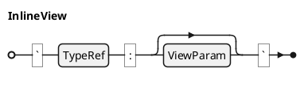

## DIC: Spec View @DIC-VW-001

A **Spec View** represents a dynamic query or generated content block. Views are materialized during the TRANSFORM phase and can generate tables of contents (TOC), lists of figures (LOF), or custom queries, abbreviations, and inline math. Views enable dynamic document assembly based on specification data.

### Content Model

A **Spec View** is formally defined as a tuple `$: V = (tau, d)` where:
- `$: tau in Gamma . TT_V` is the view type (e.g., TOC, LOF, TRACEABILITY_MATRIX, ABBREV).
- `$: d in "AST" uu {bot}` is the materialized content (`$: bot` before TRANSFORM; an AST fragment after materialization).

### Grammar

See [DIC-SYN-001](@) for the full syntax reference. The core production is:

> traceability: [HLR-TYPE-004](@)
