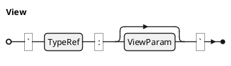

## Spec View @specIR-06

A **Spec View** represents a dynamic query or generated content block. Views are materialized during the TRANSFORM phase and can generate tables of contents (TOC), lists of figures (LOF), or custom queries, abbreviations, and inline math. Views enable dynamic document assembly based on specification data.

### Declaration

A **Spec View** is formally defined as a pair `$: V = (tau, omega)` where:
- `$: tau in Gamma . TT_V` is the view type (e.g., TOC, LOF, TRACEABILITY_MATRIX, ABBREV).
- `$: omega` is a raw string passed as a parameter to the view handler.

### Syntax

