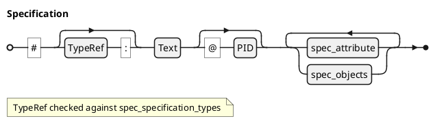

### Specification @specIR-01

A **Specification** is the root document container created from an H1 header. It represents a complete document like an SRS, SDD, or SVC. Each specification has a type, optional PID, and contains attributes and all spec objects within that document.

#### Declaration

A **Specification** is formally defined as a tuple `$: S = (tau, n, "pid", cc A, cc O)` where:
- `$: tau in Gamma . TT_S` is the specification type (defined by the environment, e.g. SRS, SDD, SVC, TRR).
- `$: n in "String"` is the document title (from the H1 header).
- `$: "pi"d in "String"` is the global project identifier (auto-generated from `$: tau` when not explicit).
- `$: cc A sube "SpecAttribute"` is the set of typed attributes (version, status, date, etc.).
- `$: cc O sube "SpecObject"` is the set of child spec objects.

#### Syntax

