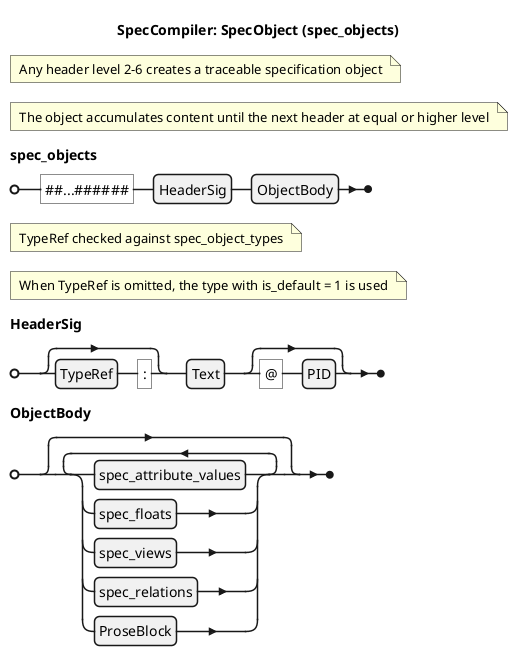
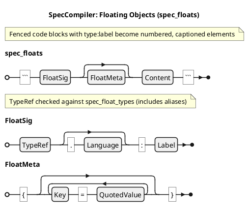
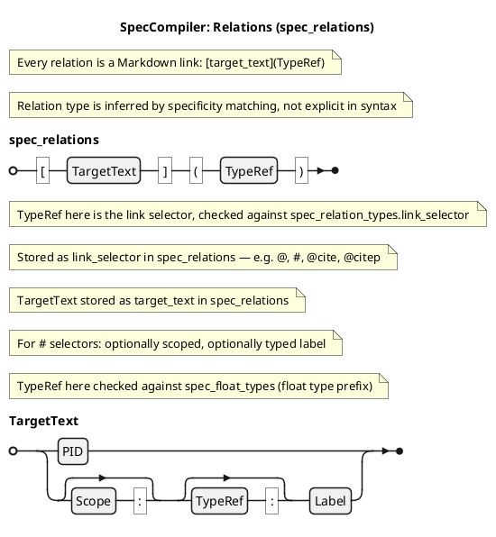
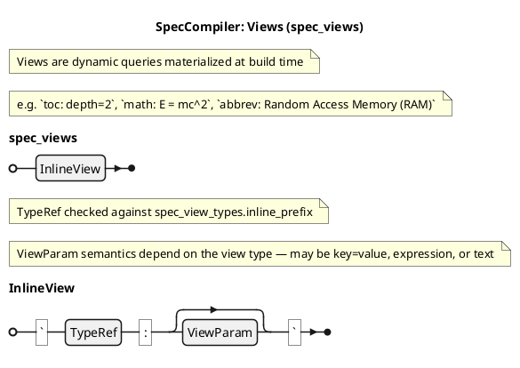
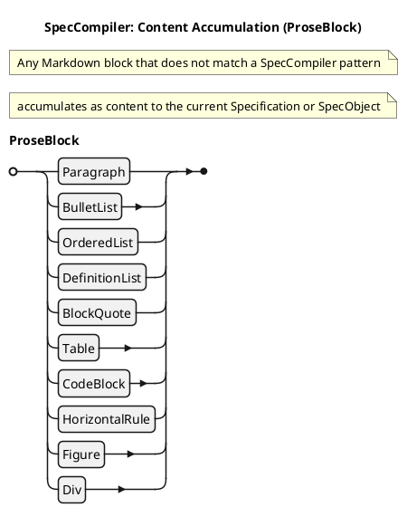
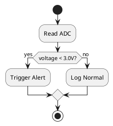

## DIC: Syntax Reference @DIC-SYN-001

This section defines the SpecCompiler grammar at the **Pandoc AST level**. SpecCompiler documents are standard Markdown processed through Pandoc; the parser recognizes specific AST patterns and promotes them to specification elements. Everything else accumulates as content to the current owner.

The formal grammar is maintained in `definitive_grammar.md` (verified against `src/pipeline/initialize/*.lua`). Railroad diagrams are in `docs/grammar/railroad/`.

---

### AST Mapping

```list-table:tbl-ast-mapping{caption="Pandoc AST to SpecCompiler Mapping"}
> header-rows: 1
> aligns: l,l,l,l,l

* - Markdown
  - Pandoc Element
  - Properties
  - SpecCompiler Type
  - Match Condition
* - `# type: Title @PID`
  - Header
  - level: Int, inlines: [Inline]
  - Specification
  - level == 1
* - `## type: Title @PID`
  - Header
  - level: Int, inlines: [Inline]
  - SpecObject
  - level > 1
* - `> key: value`
  - BlockQuote
  - blocks: [Block]
  - Attribute
  - first Para matches `/^[%w_]+:/` pattern
* - ` ```type.lang:label{attrs}``` `
  - CodeBlock
  - classes: [String], text: String
  - SpecFloat
  - first class matches FloatSig AND type exists in `spec_float_types`
* - `` `PREFIX: content` ``
  - Code
  - text: String
  - SpecView (inline)
  - prefix is a registered `inline_prefix` in `spec_view_types`
* - `[target_text](selector)`
  - Link
  - text: [Inline], target: String
  - SpecRelation
  - target starts with `@` or `#` (stored as `link_selector`); reference is in link text (stored as `target_text`)
* - Para, BulletList, etc.
  - Block
  - (varies)
  - Content
  - no special pattern (accumulates to owner)
```

---

### Railroad Diagrams

The grammar produces the following railroad diagrams (generated from PlantUML EBNF in `docs/grammar/railroad/`):

#### Document Structure

```plantuml:fig-rr-document{caption="Document and Specification productions"}
@startebnf
title SpecCompiler: Document Structure
(* What you type in Markdown to create specifications and objects *)

Document = Specification;

Specification = "#", HeaderSig, { spec_attribute_values | spec_objects | spec_floats | spec_views | ProseBlock };

spec_objects = "##...######", HeaderSig, { spec_attribute_values | spec_floats | spec_views | ProseBlock };

(* TypeRef checked against spec_specification_types (H1) or spec_object_types (H2+) *)
(* When TypeRef is omitted, the type with is_default = 1 in the type table is used *)
HeaderSig = [ TypeRef, ":" ], Text, [ "@", PID ];

@endebnf
```

#### SpecObjects



#### Attributes

```plantuml:fig-rr-attributes{caption="Attribute extraction from BlockQuote"}
@startebnf
title SpecCompiler: Attributes (spec_attribute_values)
(* A blockquote whose first paragraph starts with TypeRef ":" *)
(* Otherwise the blockquote is plain prose content *)

(* TypeRef checked against spec_attribute_types for the owner's type *)
spec_attribute_values = ">", TypeRef, ":", ProseBlock;

@endebnf
```

#### Floating Objects



#### Relations



#### Views



#### Content Accumulation



---

### Syntax Quick Reference

#### Specification (H1)

```markdown
# type: Title @PID
# srs: Software Requirements Specification @SRS-001
# My Document
```

See [specIR-01](@) for full semantics.

#### SpecObject (H2-H6)

```markdown
## type: Title @PID
## hlr: User Authentication @HLR-AUTH-001
```

See [specIR-02](@) for full semantics.

#### Attribute (BlockQuote)

```markdown
> priority: high

> status: draft

> rationale: Safety-critical requirement
>
> Extended content with paragraphs and lists.
```

See [DIC-ATTR-001](@) for full semantics and datatypes.

#### SpecFloat (CodeBlock)

````markdown
```type.lang:label{key="val"}
content
```
````

See [specIR-03](@) for full semantics.

#### SpecView (Code)

```markdown
`toc:`
`lof:`
```

See [DIC-VW-001](@) for full semantics.

#### SpecRelation (Link)

```markdown
[HLR-001](@)
[fig:auth-flow](#)
[scope:type:label](#)
[smith2024](@cite)
```

See [DIC-REL-001](@) for full semantics and inference algorithm.

---

### Content Accumulation

Any block that does not match the patterns above is treated as **Content** and appended to the currently active owner (Specification or SpecObject). The accumulation rule:

- **H1** opens a Specification context — all content accumulates to it
- **H2+** opens a SpecObject context — content accumulates to it until the next header at equal or higher level

---

### Worked Example: Markdown to Spec-IR

#### Input Markdown

```markdown
# srs: Battery Monitor @SRS-001

> status: draft

This specification defines the battery monitoring subsystem.

## hlr: Voltage Check @HLR-001

> priority: high

> rationale: Safety-critical monitoring

The system shall check battery voltage every 100ms.

- Voltage range: 2.5V to 4.2V
- Alert threshold: below 3.0V

See [fig:voltage-flow](#) for the monitoring diagram.



#### What the Parser Produces

The input above populates the Spec-IR with:

- 1 Specification (SRS-001)
- 2 SpecObjects (HLR-001, HLR-002)
- 4 Attributes (status, priority x2, rationale)
- 1 SpecFloat (fig-voltage-flow, PLANTUML type)
- 2 SpecRelations (XREF_FIGURE to fig-voltage-flow, inferred reference to SYS-SAFETY-001)
- Prose content accumulated to each object's `ast` field

See the dedicated dictionary entries ([specIR-01](@) through [DIC-ATTR-001](@)) for the complete schema of each table.
