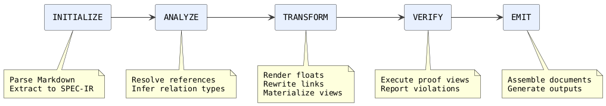
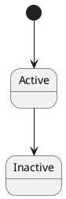
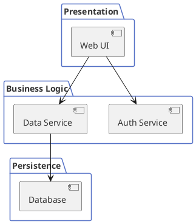

# SpecCompiler Core User Manual @MANUAL

> version: 1.0

> document_id: SC-UM-001

## COVER: SpecCompiler Core User Manual

> subtitle: Structured Document Processing Pipeline

> author: SpecCompiler Project

> date: 2026-02-21

> version: 1.0

> document_id: SC-UM-001

This manual is itself a complete working example of a SpecCompiler document authored with `template: default`. Every feature described in these pages -- floats, cross-references, abbreviations, charts, diagrams, views, and math -- is also demonstrated inline. Process this file with `specc build` to see the rendered output. The companion guides *Creating a Custom Model* and *DOCX Customization* are included in the same project and can be cross-referenced by section label.

`toc:`

## Introduction

### What is SpecCompiler?

SpecCompiler is a document processing pipeline that transforms structured Markdown specifications into multiple output formats (DOCX, HTML5). It provides:

- **Structured authoring**: Define requirements, designs, and verification cases using a consistent syntax.
- **Traceability**: Link objects together with `abbrev: Project Identifier (PID)` and `#label` references.
- **Validation**: Automatically verify data integrity through proof views backed by `abbrev: Structured Query Language (SQL)` queries against the `abbrev: Specification Intermediate Representation (SPEC-IR)`.
- **Multi-format output**: Generate Word documents and web content from a single source.

SpecCompiler processes documents through a five-phase pipeline: INITIALIZE, ANALYZE, TRANSFORM, VERIFY, and EMIT, as illustrated in [plantuml:diag-pipeline](#).

### Scope

This manual covers:

- Installation and verification of the SpecCompiler-Core Docker image (see [MANUAL-sec2](@)).
- Configuration of project files (`project.yaml`) as described in [section:project-configuration](#).
- Authoring specification documents using the SpecCompiler Markdown syntax ([MANUAL-sec4](@)).
- Invocation of the tool and interpretation of its outputs ([section:invocation](#)).
- Verification diagnostics and error code reference.
- Incremental build behavior and cache management.
- Type system configuration and custom model creation; for a detailed walkthrough, see [section:model-directory-layout](#) in the companion model guide.
- Troubleshooting common problems.

### Pipeline Summary

The processing pipeline consists of five phases:

1. **INITIALIZE** -- Parse Markdown input via `abbrev: Pandoc Abstract Syntax Tree (AST)`, extract specifications, spec objects, attributes, floats, relations, and views into the SPEC-IR stored in `abbrev: SQLite Database (SQLite)`.
2. **ANALYZE** -- Resolve relation types and cross-references using specificity-based inference rules (see [math:eq-specificity](#)).
3. **TRANSFORM** -- Resolve floats (render PlantUML, charts, tables), materialize views, rewrite links, and render spec objects using type-specific handlers.
4. **VERIFY** -- Execute proof views (SQL queries) against the SPEC-IR database to detect constraint violations; see [section:validation-proofs](#) in the model guide.
5. **EMIT** -- Assemble Pandoc documents from the SPEC-IR and generate output files in configured formats via parallel Pandoc subprocess invocations.



```chart:chart-pipeline-ops{caption="Operations per Pipeline Phase"}
{
  "xAxis": { "type": "category", "data": ["INITIALIZE", "ANALYZE", "TRANSFORM", "VERIFY", "EMIT"] },
  "yAxis": { "type": "value", "name": "Handler count" },
  "series": [{ "type": "bar", "data": [6, 2, 5, 1, 3], "itemStyle": { "color": "#5470c6" } }]
}
```

The handler counts shown in [chart:chart-pipeline-ops](#) reflect the default model. Custom models may add handlers in any phase.

## Installation

### Prerequisites

The following are required to run SpecCompiler-Core:

```list-table:tbl-prerequisites{caption="Runtime prerequisites"}
> header-rows: 1
> aligns: l,l,l

* - Prerequisite
  - Minimum Version
  - Notes
* - Docker runtime
  - 20.10+
  - Docker Desktop or Docker Engine (daemon must be running)
* - Disk space
  - 2 GB
  - For the Docker image and build artifacts
* - Host OS
  - Linux, macOS, or Windows (with WSL2)
  - The container runs Debian Bookworm (slim)
```

All dependency versions are pinned in `scripts/versions.env`. The Docker image bundles:

- Lua 5.4 (compiled from source)
- Pandoc 3.6.1 (compiled from source with system-lua)
- SQLite (via lsqlite3 native extension)
- PlantUML (with minimal jlinked JRE)
- GraphViz
- Deno (for ECharts rendering)

### Building the Image

Run the Docker installer from the repository root:

```src.bash:src-build-image{caption="Build and install via Docker"}
bash scripts/install.sh
```

This performs three steps:

1. **Docker build** -- Executes a multi-stage Docker build:
   - **Stage 1 (Builder)** -- Compiles Lua, Pandoc, and native Lua extensions (luv, lsqlite3, zip) from source. Builds Deno TypeScript utilities into standalone binaries. Downloads and wraps PlantUML with a minimal JRE.
   - **Stage 2 (Runtime)** -- Copies only runtime artifacts into a lean Debian Bookworm image without build tools.
2. **Wrapper generation** -- Creates a `specc` `abbrev: Command-Line Interface (CLI)` command at `~/.local/bin/specc`.
3. **Config** -- Writes the image reference to `~/.config/speccompiler/env`.

Use `--force` to rebuild from scratch, or `--code-only` to quickly update just the `src/` and `models/` layers without recompiling Pandoc.

### Verifying Installation

After building, verify the image is available:

```src.bash:src-verify-image{caption="Verify Docker image availability"}
docker images speccompiler-core
```

To verify the tool runs correctly, navigate to a directory containing a `project.yaml` file and run:

```src.bash:src-run-wrapper{caption="Run wrapper command"}
specc build
```

### The specc Wrapper

The `specc` command is a Docker wrapper generated by the installer. It supports three subcommands:

```list-table:tbl-wrapper-commands{caption="Wrapper subcommands"}
> header-rows: 1
> aligns: l,l

* - Command
  - Description
* - `specc build [project.yaml]`
  - Build the project (default file: `project.yaml`)
* - `specc clean`
  - Remove `build/` directory and `specir.db`
* - `specc shell`
  - Open an interactive Bash shell inside the container
```

The `build` subcommand runs `docker run --rm` with:

- `--user "$(id -u):$(id -g)"` -- Preserves host UID/GID.
- `-v "$(pwd):/workspace"` -- Mounts current directory.
- `-e "SPECCOMPILER_HOME=/opt/speccompiler"` -- Sets installation root.
- `-e "SPECCOMPILER_DIST=/opt/speccompiler"` -- Sets distribution root.
- `-e "SPECCOMPILER_LOG_LEVEL=${SPECCOMPILER_LOG_LEVEL:-INFO}"` -- Passes log level.

Inside the container, the `speccompiler-core` entry point invokes Pandoc with the SpecCompiler Lua filter. The `-o /dev/null` Pandoc flag is intentional -- actual output files are generated by the EMIT phase.

## Project Configuration

All project configuration is specified in a `project.yaml` file located in the project root directory.

### Complete Configuration Reference

```src.yaml:src-project-yaml{caption="project.yaml reference"}
# ============================================================================
# Project Identification (REQUIRED)
# ============================================================================
project:
  code: MYPROJ          # Project code identifier (string, required)
  name: My Project SRS  # Human-readable project name (string, required)

# ============================================================================
# Type Model (REQUIRED)
# ============================================================================
template: default        # Type model name (string, default: "default")
                         # Must match a directory under models/

# ============================================================================
# Logging Configuration (OPTIONAL)
# ============================================================================
logging:
  level: info            # DEBUG | INFO | WARN | ERROR (default: "INFO")
  format: auto           # auto | json | text (default: "auto")
  color: true            # ANSI color codes (default: true)

# ============================================================================
# Validation Policy (OPTIONAL)
# ============================================================================
validation:
  missing_required: ignore
  cardinality_over: ignore
  invalid_cast: ignore
  invalid_enum: ignore
  invalid_date: ignore
  bounds_violation: ignore
  dangling_relation: ignore
  unresolved_relation: ignore

# ============================================================================
# Input Files (REQUIRED)
# ============================================================================
output_dir: build/       # Base output directory (default: "build")

doc_files:               # Markdown files to process, in order
  - srs.md
  - sdd.md

# ============================================================================
# Output Format Configurations (OPTIONAL)
# ============================================================================
outputs:
  - format: docx
    path: build/docx/{spec_id}.docx
  - format: html5
    path: build/www/{spec_id}.html

# ============================================================================
# DOCX Configuration (OPTIONAL)
# ============================================================================
docx:
  preset: null           # Style preset name (models/{template}/presets/)
  # reference_doc: assets/reference.docx  # Custom Word reference

# ============================================================================
# HTML5 Configuration (OPTIONAL)
# ============================================================================
html5:
  number_sections: true
  table_of_contents: true
  toc_depth: 3
  standalone: true
  embed_resources: true
  resource_path: build

# ============================================================================
# Bibliography and Citations (OPTIONAL)
# ============================================================================
bibliography: refs.bib
csl: ieee.csl
```

### Required Fields

```list-table:tbl-required-fields{caption="Required project fields"}
> header-rows: 1
> aligns: l,l,l

* - Field
  - Type
  - Description
* - `project.code`
  - string
  - Project code identifier
* - `project.name`
  - string
  - Human-readable project name
* - `doc_files`
  - list
  - One or more Markdown file paths to process
```

### Default Values

```list-table:tbl-default-values{caption="Default configuration values"}
> header-rows: 1
> aligns: l,l,l

* - Field
  - Default
  - Notes
* - `template`
  - `default`
  - Built-in base model is always loaded
* - `output_dir`
  - `build`
  - Also stores `specir.db`
* - `logging.level`
  - `INFO`
  - Overridden by `SPECCOMPILER_LOG_LEVEL` env var
```

## Document Authoring

SpecCompiler extends standard Markdown with a structured overlay for specification documents. The syntax uses existing Markdown constructs (headers, blockquotes, code blocks, links) with specific patterns that the pipeline recognizes.

### Specifications

Level 1 headers declare the top-level document container.

**Pattern:** `# type: Title @PID`

```src.markdown:src-specification-pattern{caption="Specification declaration"}
# srs: Software Requirements Specification @SRS-001
```

### Spec Objects

Level 2-6 headers declare requirements, design elements, sections, or any typed element.

**Pattern:** `## type: Title @PID`

```src.markdown:src-object-pattern{caption="Spec object declaration"}
## hlr: User Authentication @HLR-001
### llr: Password Validation @LLR-001
#### section: Implementation Notes
```

If `@PID` is omitted, a PID is auto-generated using the type's `pid_prefix` and `pid_format`.

### Attributes

Blockquotes declare attributes using the `key: value` pattern. They belong to the most recently opened Specification or SpecObject header and do not need to appear immediately after it:

```src.markdown:src-attribute-pattern{caption="Attribute declaration"}
## hlr: User Authentication @HLR-001

> priority: High

> status: Draft

> rationale: Required by security policy
```

Rules:

- Each attribute blockquote must be separated by a blank line.
- The first line must match `key: value` (where `key` is `[A-Za-z0-9_]+`). If not, the blockquote is treated as prose. The key does not need to be a registered attribute type; unregistered keys default to `STRING` datatype.
- Multi-line values are supported: continuation lines append to the preceding attribute.
- Supported datatypes: `STRING`, `INTEGER`, `REAL`, `BOOLEAN`, `DATE` (YYYY-MM-DD), `ENUM`, `XHTML`.

### Floats

Fenced code blocks with a typed first class declare numbered elements.

**Pattern:** `` ```type.lang:label{key="val"} ``

#### PlantUML Diagram

````src.markdown:src-plantuml-float-syntax{caption="PlantUML float syntax"}

````

#### Table

````src.markdown:src-table-float-syntax{caption="Table float syntax"}
```list-table:tbl-interfaces{caption="External Interfaces"}
> header-rows: 1
> aligns: l,l,l

* - Interface
  - Protocol
  - Direction
* - GPS
  - ARINC-429
  - Input
```
````

#### CSV Table

The `abbrev: Comma-Separated Values (CSV)` float alias provides a compact syntax for tabular data:

````src.markdown:src-csv-float-syntax{caption="CSV float syntax"}
```csv:tbl-data{caption="Sample Data"}
Name,Value,Unit
Temperature,72.5,F
Pressure,1013.25,hPa
```
````

Both `csv` and `list-table` produce TABLE floats. Use `csv` for simple tabular data and `list-table` for tables with rich Markdown content in cells. See [section:floats-in-practice](#) for live examples of each.

#### Listing (Code)

````src.markdown:src-listing-float-syntax{caption="Listing float syntax"}
```listing.c:lst-init{caption="Initialization Routine"}
void init(void) {
    setup_hardware();
}
```
````

#### Chart (ECharts)

````src.markdown:src-chart-float-syntax{caption="Chart float syntax"}
```chart:chart-coverage{caption="Test Coverage"}
{
  "xAxis": { "data": ["Module A", "Module B"] },
  "series": [{ "type": "bar", "data": [95, 87] }]
}
```
````

Charts support data injection via view modules. Add `view="gauss"` and `params="mean=0,sigma=1"` to the code fence attributes to inject generated data into the ECharts configuration at render time. See [chart:chart-gauss](#) for a working example.

#### Math

````src.markdown:src-math-float-syntax{caption="Math float syntax"}
```math:eq-force{caption="Newton's Second Law"}
F = ma
```
````

Math floats use AsciiMath notation and are rendered to MathML for HTML5 output and OMML for DOCX. See [math:eq-specificity](#) and [math:eq-latency](#) for live examples in this manual.

#### Float Syntax Summary

```list-table:tbl-float-syntax{caption="Float syntax components"}
> header-rows: 1
> aligns: l,l

* - Component
  - Description
* - `type`
  - Float type identifier (for example `figure`, `plantuml`, `csv`, `list-table`, `listing`, `chart`, `math`)
* - `.lang`
  - Optional language hint for syntax highlighting
* - `:label`
  - Float label for cross-referencing; must be unique within the specification
* - `{key="val"}`
  - Key-value attributes; common attribute: `caption`
```

### Relations (Links)

Links use the pattern `[content](selector)`. Selectors are **not hardcoded** -- they are registered by relation types in the model's type system. Each relation type declares a `link_selector` field, and the pipeline uses it for resolution and type inference. The `default` model registers the following selectors:

```list-table:tbl-selectors{caption="Default model selectors"}
> header-rows: 1
> aligns: l,l,l

* - Selector
  - Registered by
  - Resolution
* - `@`
  - `traceable` base (XREF_SEC, and model-specific types)
  - PID lookup: same-spec first, then cross-document fallback
* - `#`
  - `xref` base (XREF_FIGURE, XREF_TABLE, XREF_LISTING, XREF_MATH, XREF_SECP)
  - Scoped label resolution: local scope, then same-spec, then global
* - `@cite`
  - XREF_CITATION
  - Rewritten to pandoc Cite element (parenthetical)
* - `@citep`
  - XREF_CITATION
  - Rewritten to pandoc Cite element (in-text)
```

Custom models can register additional selectors by defining relation types with new `link_selector` values.

```list-table:tbl-relation-syntax{caption="Relation syntax patterns"}
> header-rows: 1
> aligns: l,l,l

* - Syntax
  - Example
  - Description
* - `[PID](@)`
  - `[HLR-001](@)`
  - Reference by PID
* - `[type:label](#)`
  - `[fig:diagram](#)`
  - Typed float reference
* - `[scope:type:label](#)`
  - `[REQ-001:fig:detail](#)`
  - Scoped float reference
* - `[key](@cite)`
  - `[smith2024](@cite)`
  - Parenthetical citation
* - `[key](@citep)`
  - `[smith2024](@citep)`
  - In-text citation
```

#### Type Inference

After a link is resolved, the inference algorithm scores it against all registered relation types using 4 unweighted dimensions. Each matching dimension adds +1 to the specificity score. A constraint mismatch eliminates the candidate entirely. The total score for a candidate is computed as:

```math:eq-specificity{caption="Relation Type Specificity Score"}
S = sum_(i=1)^(4) d_i , quad d_i in {0, 1}
```

The four dimensions (`eq: d_1` through `eq: d_4`) correspond to selector, source attribute, source type, and target type as shown in [list-table:tbl-inference-scoring](#):

```list-table:tbl-inference-scoring{caption="Type inference scoring dimensions"}
> header-rows: 1
> aligns: l,c,l,c

* - Dimension
  - Match
  - Constraint mismatch
  - No constraint (NULL)
* - **Selector** (`@`, `#`, `@cite`, etc.)
  - +1
  - Eliminated
  - +0
* - **Source attribute**
  - +1
  - Eliminated
  - +0
* - **Source type**
  - +1
  - Eliminated
  - +0
* - **Target type**
  - +1
  - Eliminated
  - +0
```

The highest-scoring candidate wins. If two candidates tie, the relation is marked ambiguous. For example, `[fig:diagram](#)` resolving to a FIGURE float will match XREF_FIGURE (selector `#` + target type FIGURE = specificity `eq: S = 2`) over the generic xref base (selector `#` only = specificity `eq: S = 1`).

### Views

Inline code with a specific prefix declares view placeholders:

```src.markdown:src-inline-view{caption="Inline view placeholder"}
`toc:`
```

Default model view types:

```list-table:tbl-view-types{caption="Default view types"}
> header-rows: 1
> aligns: l,l,l

* - Type
  - Aliases
  - Description
* - `toc`
  - ---
  - `abbrev: Table of Contents (TOC)` from spec object headings
* - `lof`
  - `lot`
  - List of floats (figures, tables, etc.)
* - `abbrev`
  - `sigla`, `acronym`
  - Define an abbreviation inline: `abbrev: Full Meaning (ABBR)`
* - `abbrev_list`
  - `sigla_list`, `acronym_list`
  - Render a sorted table of all abbreviations defined via `abbrev:`
* - `math_inline`
  - `eq`, `formula`
  - Inline math expression rendered to MathML/OMML
* - `gauss`
  - `gaussian`, `normal`
  - Generate Gaussian distribution data for chart floats
```

### Body Content

Prose paragraphs, lists, and tables between headers accumulate to the most recently opened Specification or Spec Object.

### File Includes

Split large documents into multiple files using fenced code blocks with the `include` class:

````src.markdown:src-file-include{caption="Include directive syntax"}
```include
path/to/chapter1.md
path/to/chapter2.md
```
````

Each line is a file path relative to the including document's directory. Absolute paths are also supported. Lines starting with `#` are treated as comments and ignored.

Include blocks are expanded recursively before the pipeline runs. Circular includes are detected and produce an error. The maximum nesting depth is 100 levels.

Included files are tracked in the build graph for incremental builds -- a change to any included file triggers a rebuild.

## Using the Default Model

### Rationale

The `default` model ships a complete document authoring toolkit so that authors can write structured technical documents without defining custom types. It provides:

- **Numbered floats** -- figures, tables, code listings, math equations, PlantUML diagrams, and ECharts charts, each with automatic numbering and captions.
- **Typed cross-references** -- relation types that resolve `@` and `#` links to specific float and object categories, enabling the pipeline to render appropriate display text (for example, "Figure 3" or "Table 1").
- **Bibliography citations** -- integration with Pandoc's citeproc for parenthetical and in-text citation rendering from BibTeX files.
- **Content views** -- generated content blocks such as TOC, list of figures, abbreviation tables, and inline math.

The following subsections demonstrate these features with live floats and cross-references. Every float, view, and link shown below is processed by SpecCompiler when this manual is built.

### Floats in Practice

A SpecCompiler document can use all default float types. Each float has a type prefix, a label for cross-referencing, and a caption. The examples below are live -- they are rendered when this manual is processed.

#### Architecture Diagram (PlantUML)



#### Component Table (list-table)

```list-table:tbl-components{caption="System Components"}
> header-rows: 1
> aligns: l,l,l

* - Component
  - Layer
  - Technology
* - Web UI
  - Presentation
  - React
* - Auth Service
  - Business Logic
  - Node.js
* - Data Service
  - Business Logic
  - Python
* - Database
  - Persistence
  - PostgreSQL
```

#### Performance Metrics (CSV)

```csv:tbl-metrics{caption="Performance Metrics"}
Metric,Target,Actual,Status
Response time (ms),200,185,Pass
Throughput (req/s),1000,1120,Pass
Error rate (%),1.0,0.3,Pass
Memory usage (MB),512,487,Pass
```

#### Initialization Code (Listing)

```listing.python:lst-init{caption="Service Initialization"}
def initialize(config):
    db = connect(config.db_url)
    auth = AuthService(db)
    return Application(auth, db)
```

#### Latency Model (Math)

```math:eq-latency{caption="Expected Latency"}
L = T_(network) + T_(processing) + T_(db)
```

#### Throughput Chart (ECharts)

```chart:chart-throughput{caption="Throughput by Module"}
{
  "xAxis": { "type": "category", "data": ["Auth", "Data", "Search", "Notify"] },
  "yAxis": { "type": "value", "name": "req/s" },
  "series": [{ "type": "bar", "data": [1200, 3400, 890, 2100], "itemStyle": { "color": "#91cc75" } }]
}
```

### Cross-References

Every float and object defined above can be referenced from prose. The following paragraph demonstrates cross-reference resolution using the `#` selector.

The system architecture is depicted in [plantuml:diag-layers](#). Component details, including the technology stack for each layer, are listed in [list-table:tbl-components](#). Performance targets and actuals are compared in [csv:tbl-metrics](#) -- all four metrics pass their thresholds. The initialization logic is shown in [listing:lst-init](#), and the latency model driving performance requirements is defined by [math:eq-latency](#). Finally, throughput measurements by module are visualized in [chart:chart-throughput](#).

The `@` selector resolves by PID and works across documents. For example, this sentence references the introduction of this manual: [MANUAL-sec1](@). Cross-document references to the companion guides also work; see [section:model-directory-layout](#) for the model directory layout and [section:style-presets](#) for DOCX style presets.

```list-table:tbl-xref-selectors{caption="Cross-reference selector comparison"}
> header-rows: 1
> aligns: l,l,l

* - Selector
  - Syntax
  - Resolution
* - `@` (PID)
  - `[PID](@)`
  - Exact PID lookup. Same-spec first, then cross-document fallback. Never ambiguous.
* - `#` (Label)
  - `[type:label](#)`
  - Scoped resolution: local scope, then same specification, then global. May be ambiguous if multiple matches at the same scope level.
```

### Section References

Headers without an explicit `TYPE:` prefix default to the SECTION type. Sections receive auto-generated PIDs and labels that can be used for cross-referencing:

- **PID format**: `{spec_pid}-sec{depth.numbers}` -- for example, `SRS-sec1`, `SRS-sec1.2`, `SRS-sec2.3.1`. Use the `@` selector: `[SRS-sec1.2](@)`.
- **Label format**: `section:{title-slug}` -- for example, `## Introduction` produces the label `section:introduction`. Use the `#` selector: `[section:introduction](#)`.

The `@` selector performs an exact PID lookup and is never ambiguous. The `#` selector uses scoped resolution (closest scope wins), which is useful when multiple specifications have sections with similar names.

For cross-document section references with the `#` selector, use the explicit scope syntax: `[SPEC-A:section:design](#)` to target a section labeled "design" within the specification whose PID is `SPEC-A`.

This manual references its own sections using both selectors. Here are examples that resolve within this document:

- By PID: [MANUAL-sec2](@) links to Installation, [MANUAL-sec4](@) links to Document Authoring.
- By label: [section:pipeline-summary](#) links to Pipeline Summary, [section:troubleshooting](#) links to Troubleshooting.

Cross-document references work identically. Because the companion guides are listed in the same `project.yaml`, these links resolve at build time:

- [section:walkthrough-custom-float-type](#) links to the float walkthrough in the model guide.
- [section:postprocessors](#) links to the DOCX customization guide.
- [section:preset-inheritance](#) links to preset inheritance in the DOCX guide.

### Citations and Bibliography

SpecCompiler integrates with Pandoc's citeproc processor for scholarly citations.

**Step 1.** Add bibliography configuration to `project.yaml`:

```src.yaml:src-bib-config{caption="Bibliography configuration in project.yaml"}
bibliography: refs.bib
csl: ieee.csl
```

**Step 2.** Create a BibTeX file (`refs.bib`):

```src.bib:src-bib-file{caption="Example BibTeX file"}
@article{smith2024,
  author  = {Smith, John},
  title   = {Advances in Systems Engineering},
  journal = {IEEE Transactions},
  year    = {2024}
}
@book{jones2023,
  author    = {Jones, Alice},
  title     = {Software Architecture Patterns},
  publisher = {O'Reilly},
  year      = {2023}
}
```

**Step 3.** Use citation syntax in your document:

```src.markdown:src-citation-syntax{caption="Citation syntax examples"}
Recent work [smith2024](@cite) demonstrates the approach.

As Smith [smith2024](@citep) argues, the method is effective.

Multiple sources support this [smith2024;jones2023](@cite).
```

- `[key](@cite)` produces a **parenthetical** citation -- for example, "(Smith, 2024)" in author-date styles or "[1]" in numeric styles.
- `[key](@citep)` produces an **in-text** citation -- for example, "Smith (2024)" or "Smith [1]".
- Multiple keys separated by `;` produce a grouped citation.

**Processing pipeline**: During the TRANSFORM phase, citation links are rewritten to Pandoc `Cite` elements. During EMIT, Pandoc's citeproc processor formats citations and appends a bibliography list to the document according to the configured CSL style.

### Views in Practice

Views generate content blocks from the SPEC-IR.

#### Abbreviations

The `abbrev:` view defines abbreviations inline. On first use, the full meaning is displayed alongside the abbreviation. All definitions are collected for the `abbrev_list` view shown in the [section:list-of-abbreviations](#) appendix.

This manual defines abbreviations on first use throughout the text. For example, `abbrev: Entity-Attribute-Value (EAV)` is the database pattern used for flexible attributes, and `abbrev: Newline-Delimited JSON (NDJSON)` is the format used for diagnostic output.

The syntax is: `` `abbrev: Full Meaning Text (ABBREVIATION)` ``. The abbreviation goes in parentheses at the end.

#### Inline Math

The `eq:` prefix renders inline math expressions using AsciiMath notation. For example, the quadratic formula is `eq: x = (-b +- sqrt(b^2 - 4ac)) / (2a)`, and Euler's identity is `eq: e^(i pi) + 1 = 0`.

Inline math is useful for formulas within prose paragraphs, while block `math:` floats (like [math:eq-specificity](#) and [math:eq-latency](#)) provide numbered equations with captions.

#### Chart with Data View Injection (Gauss)

Charts can load data dynamically from view modules using the `view` attribute. The `gauss` view generates a Gaussian probability density function and injects it into the ECharts dataset. The chart below demonstrates this -- the `view="gauss"` attribute triggers the data injection pipeline:

```chart:chart-gauss{caption="Standard Normal Distribution" view="gauss" params="mean=0,sigma=1,xmin=-3,xmax=3,points=61"}
{
  "xAxis": { "type": "value", "name": "x" },
  "yAxis": { "type": "value", "name": "f(x)" },
  "series": [{ "type": "line", "smooth": true }]
}
```

The `params` attribute passes `mean`, `sigma`, `xmin`, `xmax`, and `points` to the Gauss view's `generate()` function. The function returns an ECharts dataset that replaces the chart's placeholder data at render time. This same mechanism supports custom data views that query the SPEC-IR database; see [section:walkthrough-custom-view](#) in the model guide for details on creating view modules.

#### Generated Lists

The `lof:` and `lot:` views produce navigable lists of figures and tables. These are rendered in the appendices of this manual:

- [section:list-of-figures](#) -- generated by `lof:`
- [section:list-of-tables](#) -- generated by `lot:`
- [section:list-of-abbreviations](#) -- generated by `abbrev_list`

## Invocation

### Basic Usage

```src.bash:src-basic-usage{caption="Basic invocation"}
specc build
```

Processes all files from `doc_files` in the current directory's `project.yaml`. An alternative project file can be specified: `specc build my-project.yaml`.

### Environment Variables

```list-table:tbl-env-vars{caption="Environment variables"}
> header-rows: 1
> aligns: l,l,l

* - Variable
  - Default
  - Description
* - `SPECCOMPILER_LOG_LEVEL`
  - `INFO`
  - Override log level: `DEBUG`, `INFO`, `WARN`, `ERROR`
* - `SPECCOMPILER_HOME`
  - `/opt/speccompiler`
  - SpecCompiler installation root (model and binary lookup)
* - `SPECCOMPILER_DIST`
  - `/opt/speccompiler`
  - Distribution root (used internally for external renderers)
* - `SPECCOMPILER_IMAGE`
  - `speccompiler-core:latest`
  - Docker image reference (overrides default in wrapper)
* - `NO_COLOR`
  - (unset)
  - Disable ANSI color codes in output
```

### Exit Codes

```csv:tbl-exit-codes{caption="Exit Codes"}
Code,Meaning
0,Success: all documents processed and outputs generated
1,Failure: Docker not running or missing config or pipeline error
```

## Output Formats

Four output formats are supported. Multiple formats can be generated in a single run.

### DOCX (Microsoft Word)

- Style presets via `docx.preset` or custom `docx.reference_doc`.
- Model-specific postprocessors for format transformations.

For a complete guide on customizing DOCX output -- including paragraph styles, table styles, caption configuration, and postprocessors -- see [section:style-presets](#) and [section:postprocessors](#) in the companion *DOCX Customization* guide.

### HTML5

```list-table:tbl-html5-options{caption="HTML5 output options"}
> header-rows: 1
> aligns: l,l,l,l

* - Option
  - Type
  - Default
  - Description
* - `number_sections`
  - boolean
  - false
  - Add section numbering
* - `table_of_contents`
  - boolean
  - false
  - Generate table of contents
* - `toc_depth`
  - integer
  - 3
  - Heading depth for TOC
* - `standalone`
  - boolean
  - false
  - Produce complete HTML document
* - `embed_resources`
  - boolean
  - false
  - Embed CSS and images inline
```

### Markdown (`abbrev: GitHub-Flavored Markdown (GFM)`)

GitHub-Flavored Markdown. Useful for review platforms and static site generators.

### JSON (Pandoc AST)

Full Pandoc AST for programmatic integration with other tools.

## Verification and Diagnostics

### Diagnostic Output

Diagnostics are emitted in NDJSON format to stderr:

```src.json:src-diagnostic-ndjson{caption="Diagnostic NDJSON example"}
{"level":"error","message":"[object_missing_required] Object missing required attribute 'priority' on HLR-001","file":"srs.md","line":42}
```

### Diagnostic Reference

```list-table:tbl-error-codes{caption="Validation diagnostics"}
> header-rows: 1
> aligns: l,l

* - Policy Key
  - Description
* - `spec_missing_required`
  - Specification missing required attribute
* - `spec_invalid_type`
  - Invalid specification type reference
* - `object_missing_required`
  - Spec object missing required attribute
* - `object_cardinality_over`
  - Attribute cardinality exceeded
* - `object_cast_failures`
  - Attribute type cast failure
* - `object_invalid_enum`
  - Invalid enum value
* - `object_invalid_date`
  - Invalid date format (expected YYYY-MM-DD)
* - `object_bounds_violation`
  - Value outside declared bounds
* - `object_duplicate_pid`
  - Duplicate PID across spec objects
* - `float_orphan`
  - Float has no parent object (orphan)
* - `float_duplicate_label`
  - Duplicate float label in specification
* - `float_render_failure`
  - External render failure
* - `float_invalid_type`
  - Invalid float type reference
* - `relation_unresolved`
  - Unresolved link (PIDs are case-sensitive)
* - `relation_dangling`
  - Dangling relation (target not found)
* - `relation_ambiguous`
  - Ambiguous float reference
* - `view_materialization_failure`
  - View materialization failure
```

### Suppressing Validation Rules

Every diagnostic listed in [list-table:tbl-error-codes](#) can be suppressed or downgraded in `project.yaml` using its policy key:

```src.yaml:src-suppress-example{caption="Suppressing a validation rule"}
validation:
  float_orphan: ignore              # suppress entirely
  relation_unresolved: warn         # downgrade to warning
```

All proofs default to `error` (halt the build). Set a key to `warn` to emit a warning without halting, or `ignore` to suppress the diagnostic entirely. Custom proofs can define their own policy keys; see [section:validation-proofs](#) in the model guide.

## Incremental Builds

### Build Cache Mechanism

1. **File hashing** -- SHA-1 hash of each input file.
2. **Include dependency tracking** -- Tracked in `build_graph` table.
3. **Cache comparison** -- Current hashes vs `build_cache` table.
4. **Skip decision** -- Unchanged documents reuse cached SPEC-IR data.

### Forcing a Full Rebuild

```src.bash:src-force-rebuild{caption="Force full rebuild"}
specc clean
specc build
```

## Type System and Models

### Custom Models

Set `template: mymodel` in `project.yaml`. Types load in order:

1. `models/default/types/` -- Always loaded first.
2. `models/mymodel/types/` -- Loaded as overlay.

For a complete walkthrough on creating custom types, including object types, float types, relation types with inference rules, and view types, see the companion *Creating a Custom Model* guide. Key sections include:

- [section:model-directory-layout](#) -- Directory structure for models.
- [section:type-definition-pattern](#) -- Schema keys by category and handler lifecycle.
- [section:walkthrough-custom-object-type](#) -- Custom object type with attributes.
- [section:walkthrough-custom-relation-with-inference-rules](#) -- Relation inference scoring.
- [section:validation-proofs](#) -- SQL-based proof views for the VERIFY phase.

### Built-in Models

SpecCompiler ships with `default` and `sw_docs`. The `default` model provides general-purpose types (specifications, sections, floats, cross-references, views). The `sw_docs` model overlays `default` with types for requirements engineering and traceability:

- **Object types**: HLR, LLR, NFR, VC, TR, FD, CSC, CSU, DIC, DD, SF (all extend a common TRACEABLE base with `status` attribute and PID auto-generation)
- **Specification types**: SRS, SDD, SVC, SUM, TRR (document templates with version, status, date)
- **Relation types**: TRACES_TO, BELONGS, REALIZES, XREF_DECOMPOSITION, XREF_DIC (traceability links with specificity-based inference)
- **View types**: TRACEABILITY_MATRIX, TEST_RESULTS_MATRIX, TEST_EXECUTION_MATRIX, COVERAGE_SUMMARY, REQUIREMENTS_SUMMARY (query-based tables materialized from the SPEC-IR)
- **Proofs**: Traceability chain validation (VC-HLR, TR-VC, FD-CSC/CSU coverage)
- **Postprocessor**: Interactive single-file HTML5 web application

The `docs/engineering_docs/` directory in this repository uses `sw_docs` and serves as a living example of the model in practice.

### Type Directory Structure

```src:src-type-directory-tree{caption="Type model directory structure"}
models/{template}/
  types/
    objects/          # Spec object types
    floats/           # Float types
    relations/        # Relation types
    views/            # View types
    specifications/   # Specification types
  postprocessors/     # Format-specific post-processing
  styles/             # DOCX style presets
  filters/            # Pandoc Lua filters per output format
```

### Type Module Structure

**Object type:**

```src.lua:src-object-type-module{caption="Object type module example"}
local M = {}
M.object = {
    id = "HLR",
    long_name = "High-Level Requirement",
    pid_prefix = "HLR",
    pid_format = "%s-%03d",
    attributes = {
        { name = "priority", datatype_ref = "PRIORITY_ENUM",
          min_occurs = 1, max_occurs = 1,
          values = {"High", "Medium", "Low"} },
    }
}
return M
```

**Relation type:**

```src.lua:src-relation-type-module{caption="Relation type module example"}
local M = {}
M.relation = {
    id = "TRACES_TO",
    link_selector = "@",
    source_type_ref = "LLR",
    target_type_ref = "HLR",
}
return M
```

### Attribute Schema Fields

```list-table:tbl-attribute-schema{caption="Attribute schema fields"}
> header-rows: 1
> aligns: l,l,l,l

* - Field
  - Type
  - Default
  - Description
* - `name`
  - string
  - required
  - Attribute identifier
* - `datatype_ref`
  - string
  - `STRING`
  - STRING, INTEGER, REAL, BOOLEAN, DATE, ENUM, XHTML
* - `min_occurs`
  - integer
  - 0
  - Minimum values (0 optional, 1 required)
* - `max_occurs`
  - integer
  - 1
  - Maximum values
* - `min_value`
  - number
  - nil
  - Lower bound for numeric values
* - `max_value`
  - number
  - nil
  - Upper bound for numeric values
* - `values`
  - list
  - nil
  - Valid enum values
```

## Troubleshooting

### Docker Not Running

`Error: Docker is not running` -- Start Docker daemon, verify with `docker info`.

### No project.yaml Found

Run `specc build` from the directory containing `project.yaml`.

### PlantUML Render Failure

Verify PlantUML syntax, ensure Docker image has Java JRE, check `@startuml`/`@enduml` markers.

### Unresolved Relations

PIDs are **case-sensitive**. Verify target PID exists in `doc_files`. For cross-document references, ensure both documents are listed in the same `project.yaml`.

### Build Seems Stale

```src.bash:src-clean-stale-build{caption="Clean stale build cache"}
specc clean
specc build
```

### Debugging

```src.bash:src-debug-log-level{caption="Enable debug logging"}
SPECCOMPILER_LOG_LEVEL=DEBUG specc build
```

## Known Limitations

- **No interactive validation** -- Batch mode only, no LSP or watch mode.
- **Docker-only distribution** -- Native install requires replicating the full build environment (`scripts/build.sh --install` is provided but requires all system dependencies).
- **Single-writer SQLite** -- Concurrent builds cause locking errors; use separate output directories.
- **Float labels per-specification** -- Same label can exist across specs; use scoped syntax for cross-spec references.
- **PID case sensitivity** -- `[hlr-001](@)` will not match `@HLR-001`.

## Glossary

| Term | Definition |
|------|------------|
| **AST** | Abstract Syntax Tree - Pandoc's internal document representation |
| **EAV** | Entity-Attribute-Value - Database pattern for flexible attributes |
| **Float** | Numbered element (figure, table, diagram) that can be cross-referenced |
| **Handler** | Pipeline component that processes documents in a specific phase |
| **HLR** | High-Level Requirement |
| **PID** | Project Identifier - Unique ID for objects (e.g., `@REQ-001`) |
| **Proof View** | SQL query that validates data integrity |
| **SPEC-IR** | Specification Intermediate Representation - SQLite database schema |
| **Specification** | Root document container (one per .md file) |
| **Spec Object** | Individual item within a specification (requirement, test, section) |
| **Type** | Category definition for objects, floats, relations, or views |
| **VC** | Verification Case |
| **View** | Generated content block (TOC, LOF, abbreviation list) |

## List of Figures

`lof:`

## List of Tables

`lot:`

## List of Listings

`lof: counter_group=LISTING`

## List of Abbreviations

`abbrev_list:`
