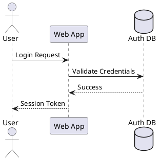
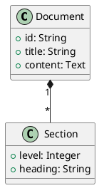

# PlantUML Test @SPEC-FLOAT-003

## Sequence Diagram

```puml:sequence-example{caption="User Login Sequence"}
@startuml
actor User
participant "Web App" as App
database "Auth DB" as DB

User -> App: Login Request
App -> DB: Validate Credentials
DB --> App: Success
App --> User: Session Token
@enduml
```

## Class Diagram

```puml:class-example{caption="Domain Model"}
@startuml
class Document {
  +id: String
  +title: String
  +content: Text
}

class Section {
  +level: Integer
  +heading: String
}

Document "1" *-- "*" Section
@enduml
```
