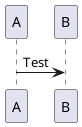

# Caption Structure Test @SPEC-FLOAT-006

This test verifies that caption divs are structured correctly for downstream
filter processing. The caption div should contain:
- Raw caption text only (not formatted with prefix/{seq}/separator)
- Attributes for prefix, separator, seq-name, float-type

## Figure with Caption

```fig:test-figure-1{caption="First Test Figure" source="Test"}
placeholder.png
```

## Second Figure

```fig:test-figure-2{caption="Second Test Figure" source="Test"}
placeholder2.png
```

## PlantUML Diagram



## Cross References

See [fig:test-figure-1](#) and [fig:test-figure-2](#) and [puml:test-diagram](#).
