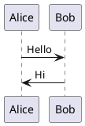

# Verify Float Errors @SVC-VERIFY-FLOATS

This test intentionally triggers float errors to verify the proof view system.

> version: 1.0

```fig:orphan-global{caption="Document-level orphan float"}
orphan-image.png
```

Expected warning: **float_orphan** (view_float_orphan)

## Section: Float Violations @SEC-FLOAT-VIOLATIONS

This section contains floats that trigger various float errors.

### float_duplicate_label: Duplicate Float Labels

The following two figures have the same label, which should trigger float_duplicate_label.

```fig:duplicate-label{caption="First figure with duplicate label"}
first-image.png
```

```fig:duplicate-label{caption="Second figure with same label"}
second-image.png
```

Expected error: **float_duplicate_label** (view_float_duplicate_label)

### float_render_failure: Render Failure (Invalid PlantUML)

The following PlantUML diagram has invalid syntax.

```puml:invalid-puml{caption="PlantUML with syntax errors"}
@startuml
This is not valid PlantUML syntax
No proper diagram definition
@enduml
```

Expected error: **float_render_failure** (view_float_render_failure) - if external rendering is enabled

### float_invalid_type: Invalid Float Type

The following code block uses an unregistered float type.

```invalid_float_type:bad-type{caption="Float with unknown type"}
Some content
```

Expected error: **float_invalid_type** (view_float_invalid_type)

## Section: Valid Float Controls @SEC-FLOAT-CONTROLS

This section contains valid floats as control cases.

### Valid Figure

```fig:valid-figure{caption="A properly defined figure"}
valid-image.png
```

### Valid Table

```csv:valid-table{caption="A properly defined table"}
Column A,Column B,Column C
Value 1,Value 2,Value 3
Value 4,Value 5,Value 6
```

### Valid PlantUML


