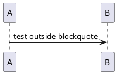

# PlantUML Blockquote Test @SPEC-PUML-TEST

Test fixture to verify PlantUML handling inside vs outside blockquotes.

## DD: Test Inside Blockquote @DD-INSIDE-001

This design decision has a diagram inside the description blockquote.

> description: The diagram below should NOT render because it's nested in a blockquote:
>
> ```puml:inside-blockquote{caption="Should NOT render"}
> @startuml
> A -> B: test inside blockquote
> @enduml
> ```

> rationale: Testing nested float behavior.

> status: Draft

## DD: Test Outside Blockquote @DD-OUTSIDE-001

This design decision has a diagram outside the description blockquote.

> description: The diagram below should render correctly.

> rationale: Testing top-level float behavior.

> status: Draft


